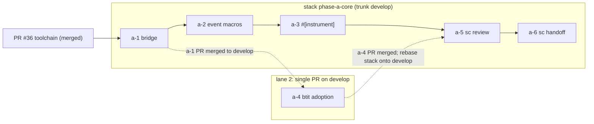

# phase-a: sc-observability-log

## Why this phase exists

btit is being migrated into the sc ecosystem. Its logging is plain text today:

- **Backend:** `log` 0.4 plus `tauri-plugin-log` writing `beads.log` (`src-tauri/src/lib.rs:42-54`, `src-tauri/Cargo.toml:37,39`).
- **Frontend:** `logFrontend()` forwards frontend messages into that file.

`sc-observability` 1.2.0 (crates.io) writes structured JSONL but has none of the following (verified in `../sc-observability` at 1.2.0):

- no `log`/`tracing` bridge (`scripts/ci/validate_dependency_bans.sh` pins an exact allowed runtime-dependency set for each core crate, and neither `log` nor `tracing` is in any of those sets)
- no event macros
- no attributes
- no compile-time tooling

phase-a builds that missing layer as a new crate pair, `sc-observability-log` and `sc-observability-log-macros`. Every sprint in the phase is written for the final destination, `../sc-observability`.

**Adoption goal (user direction, 2026-09-13):** the public macro and attribute API matches the API of commonly used tools, so a future migration means referencing a couple of crates and renaming imports:

- **`log` users:** existing `log::info!` call sites keep working unchanged through the bridge.
- **`tracing` users:** swap `use tracing::{info, instrument}` for `use sc_observability_log::{info, instrument}`. This holds for every supported form in the compatibility contract below.

Sprint a-5 delivers a critical review by the sc-observability team; sprint a-6 immediately copies the reviewed crates into `../sc-observability`, where its release workflow publishes them.

## Binding outcomes

### Destination-first crate contract

These rules apply to both crates from the first sprint onward:

- Both crates live under `crates/` at the btit repo root, in a transitional phase-a Cargo workspace at `crates/Cargo.toml`.
- They are built to sc-observability's standards: `edition = "2024"`, `rust-version = "1.94.1"`, `license = "MIT"`, sc-observability's `[workspace.lints]`, and `cargo fmt --check` plus `cargo clippy --all-targets --all-features -- -D warnings` clean. These are the sc-observability CI gates (`../sc-observability/.github/workflows/ci.yml` lines 24, 57).
- **Dependencies:** they depend only on published crates (`sc-observability = "1.2.0"`, `sc-observability-types = "1.2.0"`), never on btit code. `sc-observability-log` pins `sc-observability-log-macros` with an exact `=` version (the `serde` → `serde_core` precedent), because `#[doc(hidden)] __private` is outside semver.
- **Publishing:** `publish = false` and `version = "0.1.0"` while in btit. a-6 adopts the sc-observability workspace version.
- **btit usage:** btit consumes the crates only through path dependencies from `src-tauri/Cargo.toml`.

### Engineering standards (user direction, binding for every sprint)

- **Errors are discriminated unions.** Every error type in both crates, public or internal, is an `enum` with typed variants carrying structured fields, so callers `match` on the cause. No opaque `struct X(Box<ErrorContext>)` wrapper and no stringly-typed error. For destination compatibility each public error enum also exposes `code()` and `remediation()` per variant; internal and `#[doc(hidden)]` error enums that never reach users are mapped to a public error or counted as a `DropCause`. This differs from sc-observability's `error_wrapper!` structs and is an explicit a-5 review item. Dropped-event accounting is keyed by the `DropCause` enum.
- **No panics.** Production code in both crates, and the btit code a-4 adds or changes (`src-tauri/src/logging.rs` and `run()` in `src-tauri/src/lib.rs`), contains no `unwrap`, `expect`, `panic!`, `unreachable!`, `todo!`, `unimplemented!`, panicking indexing, or `.lock().unwrap()`; poisoning is recovered with `PoisonError::into_inner`. In `crates/` this is enforced by `[workspace.lints.clippy]` `unwrap_used`, `expect_used`, `panic`, `unreachable`, `todo`, `unimplemented`, `indexing_slicing` = `deny` on top of `pedantic` (option names verified on clippy 1.94.1 and 1.98.1); tests use per-crate `clippy.toml` `allow-*-in-tests` plus file-level `#![allow]` in `tests/*.rs`. Proc-macro input errors are `syn::Error`/`compile_error!`. `#[instrument]` never catches a user panic: it records `outcome = panicked` in a drop guard while the panic propagates.

### Compatibility contract

Migration from tracing 0.1 is an import rename for every supported form. The rejected-forms table lists the tracing-valid forms that fail loudly at compile time.

| Existing tool API | sc-observability-log equivalent | Sprint |
|---|---|---|
| `log::{trace,debug,info,warn,error}!` including `target:` and the `kv` syntax `key = value; "msg"` | unchanged call sites, captured by `sc_observability_log::init` (a `log::Log` implementation) | a-1 |
| `tracing::{trace,debug,info,warn,error,event}!` with `name:` then `target:` (tracing's order), literal or non-literal `target:`/`name:`, fields `a.b = v`, `"literal" = v`, `r#kw = v`, `{ CONST } = v`, `?v`, `%v`, shorthand `v`, the brace field form `info!({ k = v }, "fmt")` (also after `name:`/`target:`), a format message, `event!(name: "n", Level::X, ..)`, and `event!(LVL, ..)` with a const level | `sc_observability_log::{trace,debug,info,warn,error,event}!` | a-2 |
| `tracing::instrument` with `name` (a positional string, a literal or `name = CONST`), `target` (a literal or `target = CONST`), `level` (string, `Level::X`, 1-5 or a `level = CONST` path), `skip`, `skip_all`, `fields` (including `fields(a.b = 1)`, `fields({ C } = 1)`, `fields(r#type = 1)`), `ret`, `err` (plus `err(Display)`/`err(Debug)`, `ret(Display)`/`ret(Debug)`, `ret(level = ..)`, `err(level = ..)`, `ret(Display, level = ..)`) on sync and async fns; `self` is recorded via `Debug`, as tracing does | `sc_observability_log::instrument` | a-3 |

**Mapping rules:**

- **Single sanitizer, applied at runtime:** every label goes through a-1's `mapping.rs` sanitizer (`sanitize_label`, `target_label`, `action_label`, `field_key_label`), reached by a-2 and a-3 through `__private`. `::` becomes `.` and every char outside `[A-Za-z0-9._-]` becomes `_`. Macro callsites sanitize once, on first use, and cache the result in the `Callsite` `OnceLock`, for literal and non-literal `target`/`name` alike. The proc-macro crate does not sanitize.
- **Target:** `target` maps to `TargetCategory` through `target_label` (empty → `log`).
- **Action:** the tracing `name`, the instrument `name`, or a leading `[tag]` in a `log` message maps to `ActionName` through `action_label`.
- **Fields:** fields go into `LogEvent.fields` as JSON values; serialization failures are recorded as `null` plus an entry under the reserved key `sc_observability_log.serialize_errors`. A runtime field key (`{ expr } = v`) that fails `field_key_label` (empty, or the reserved prefix `sc_observability_log.`) is omitted, the event still emits, and the failure is counted as `DropCause::InvalidEvent`.
- **`log::logger().flush()`:** a no-op. The bounded flush is `LogGuard::flush(timeout)`.
- **Identity:** `LogEvent.identity` is resolved once at `init` from `LoggerConfig.process_identity`, because the sc-observability 1.2.0 runtime does not apply the policy.
- **Rejected tracing forms:** valid tracing, deliberately unsupported, rejected at compile time. Each has a trybuild case whose stderr names the form. The forms are `parent:`; `follows_from`; deferred fields via `tracing::field::Empty` or `fields(x)` without a value; the empty key `"" = v`; reserved-prefix keys `sc_observability_log.*` (string and dotted forms); and span macros (`span!`, `info_span!`, …).

### btit adoption (option 1)

- btit replaces `tauri-plugin-log` with the a-1 bridge.
- None of its 200 Rust log call-site lines or 38 `logFrontend(` call sites change.
- The log file becomes `<app_log_dir>/logs/beads-task-issue-tracker.log.jsonl`, taken from `LogGuard::active_log_path()`.
- The debug panel renders JSONL.

## Issue inventory

| Planning id | Disposition | Closure |
| --- | --- | --- |
| `a-log-bridge` | In scope | a-1: the `log::Log` → `LogEvent` bridge crate, global handle, guard, error enums, frozen API, and pure mapping with tests. |
| `a-event-macros` | In scope | a-2: tracing-compatible event macros (proc-macro) emitting `LogEvent` directly, plus the single-dependency consumer proof. |
| `a-instrument` | In scope | a-3: tracing-compatible `#[instrument]` attribute, sync and async, with panic and cancellation outcomes. |
| `a-btit-adoption` | In scope | a-4: btit switches from `tauri-plugin-log` to the bridge; log commands and the debug panel read JSONL. |
| `a-sc-review` | In scope | a-5: sc-observability team critical review; findings fixed in btit; type-placement decision recorded. |
| `a-sc-handoff` | In scope | a-6: crates copied into `../sc-observability` with every CI gate green and every governance list extended; merged-PR evidence recorded in btit. |
| `b-crate-split` | Out of phase | Moving the btit backend to root `crates/` and splitting it into multiple crates is phase-b. It depends on phase-a landing first (user direction, 2026-09-13). |
| `REFACTOR-REVIEW-B1..B13` | Out of phase | Behavior issues pinned by tests, recorded in `docs/crate-split-refactor-issues.md`. phase-a does not change btit issue/CLI behavior. |
| `REFACTOR-REVIEW-A1` | Closed by a-4 | The `app_lib::module` log-target churn stops mattering. The target becomes a `LogEvent.target` field rendered by the debug panel. |
| `REFACTOR-REVIEW-A2` | Partly closed by a-4 | a-4 deletes the platform-gated `use std::env;` in `logging.rs`. The `updates.rs` and `attachments.rs` imports stay out of phase (phase-b crate split). |
| `REFACTOR-REVIEW-A3` | No action | The wrapper + pure-core extraction was verified result-equivalent; it is an implementation change, not a behavior change. |
| `REFACTOR-REVIEW-A4` | Out of phase | Orphaned doc comment, moved comment and visibility changes belong to the phase-b crate split. |

## Prerequisites (outside this phase)

- **Toolchain — satisfied.** PR #36 (`chore/toolchain-and-version-ssot`) is merged to `develop` and present at the baseline `develop@8554294`. It pins Rust 1.98.1 (≥ 1.94.1, as the sc-observability crates require) and makes `src-tauri/Cargo.toml` a workspace with `[workspace.package]`.
- **Planning skill — satisfied.** PR #38 (exact atm-core copy of `plan-hardening` and the QA agents) is merged to `develop` and present at the baseline, so this plan is hardened with `/plan-hardening`.

## Sprint sequence

| Sprint | Branch | Stack · layer | Depends on (`must_follow`) | Parallel with (`parallel_safe`) | Authoritative plan | Production closure |
| --- | --- | --- | --- | --- | --- | --- |
| `a-1` | `feature/sprint-a-1-log-bridge` | `phase-a-core` · 1 | PR #36 (satisfied) | none | [`sprint-a-1.md`](./sprint-a-1.md) | `crates/` workspace with lints, both crate manifests with final runtime dependencies, `sc-observability-log` bridge, frozen API test, `crates` CI job on 3 OSes |
| `a-2` | `feature/sprint-a-2-event-macros` | `phase-a-core` · 2 | a-1 | a-4 | [`sprint-a-2.md`](./sprint-a-2.md) | tracing-compatible event macros, compatibility fixture, consumer-check package |
| `a-3` | `feature/sprint-a-3-instrument` | `phase-a-core` · 3 | a-2 | a-4 | [`sprint-a-3.md`](./sprint-a-3.md) | tracing-compatible `#[instrument]` (sync and async, all outcomes) plus a compatibility fixture |
| `a-4` | `feature/sprint-a-4-btit-adoption` | none (single PR on `develop`) | a-1 (PR merged) | a-2, a-3 | [`sprint-a-4.md`](./sprint-a-4.md) | btit on the bridge: JSONL file, log commands, debug panel, bounded exit |
| `a-5` | `feature/sprint-a-5-sc-review` | `phase-a-core` · 4 | a-3, a-4 (PR merged) | none | [`sprint-a-5.md`](./sprint-a-5.md) | sc-observability team critical review; every Blocking/Important finding fixed in btit; type-placement decision recorded |
| `a-6` | `feature/sprint-a-6-sc-handoff` | `phase-a-core` · 5 | a-5 | none | [`sprint-a-6.md`](./sprint-a-6.md) | crates copied into `../sc-observability` with every CI gate green; PR merged; handoff record in btit |

No deliverable is repeated across sprint checklists. Each sprint's status is its own sprint doc's `status:` frontmatter; this plan carries no status rows.

### Execution lanes



- **Lane 1, `phase-a-core`:** a-1 → a-2 → a-3 → a-5 → a-6. These are sequential and share one gh-stack.
- **Lane 2:** a-4, a single PR on `develop` with no stack. It starts once the a-1 PR is merged to `develop`, and runs in parallel with a-2 and a-3.
- **Join:** a-5 development starts only after the a-4 PR is merged to `develop` and the remaining `phase-a-core` layers have been rebased onto that `develop` (merge-forward commands below).

### Why a-4 starts at the a-1 merge rather than the a-1 push

GitHub stacks are strictly linear. A branch has exactly one parent and at most one child. `gh stack link` rejects a PR that is already in a different stack (`~/.claude/skills/gh-stack/SKILL.md`, "Known limitations" and `link`).

Stacking a-4 on the a-1 branch would give a-1 two children, which a stack cannot hold. a-4 is therefore a single PR on `develop`, branched after the a-1 PR merges. It has no stack because it is not part of a sequence.

## gh-stack and worktree workflow

Every sequential run of sprints, here `phase-a-core` (a-1 → a-2 → a-3 → a-5 → a-6), is one GitHub stack. Each layer is developed in its own `/sc-git-worktree` worktree under `../beads-task-issue-tracker-worktrees/<branch>`. The worktree's row in `../beads-task-issue-tracker-worktrees/worktree-tracking.md` (outside the repo, maintained by `/sc-git-worktree`) is added by the sprint that creates the worktree and marked cleaned by that sprint after its PR merges. It is a local operational record, not a QA gate; the QA-visible record is each sprint doc's `worktree:` frontmatter field.

**Verified constraint:** gh-stack's local tracking commands do not work with a worktree per layer. Tested locally with gh-stack v0.1.0 on 2026-09-13:
- `gh stack rebase` fails with `fatal: 's2' is already used by worktree at …`.
- Inside a linked worktree, `init`, `add`, `rebase`, `sync` and `view` all fail with `current branch "s2" is not part of a stack`.
- A plain `git rebase <parent>` inside the child's own worktree works.

The stack is therefore managed on GitHub with `gh stack link`, which creates no local tracking, and layers are rebased with git in each worktree. This is the pattern already used for btit stack #31 (PRs #29, #30, #32).

```bash
# Layer creation: from the repo root, branch each layer from its parent (sc-git-worktree convention)
git worktree add -b feature/sprint-a-1-log-bridge   ../beads-task-issue-tracker-worktrees/feature/sprint-a-1-log-bridge   origin/develop
git worktree add -b feature/sprint-a-2-event-macros ../beads-task-issue-tracker-worktrees/feature/sprint-a-2-event-macros feature/sprint-a-1-log-bridge   # when a-1 development is pushed
git worktree add -b feature/sprint-a-3-instrument   ../beads-task-issue-tracker-worktrees/feature/sprint-a-3-instrument   feature/sprint-a-2-event-macros # when a-2 development is pushed
git worktree add -b feature/sprint-a-5-sc-review    ../beads-task-issue-tracker-worktrees/feature/sprint-a-5-sc-review    feature/sprint-a-3-instrument   # when a-3 is pushed AND the a-4 PR is merged (rebase a-3 onto develop first)
git worktree add -b feature/sprint-a-6-sc-handoff   ../beads-task-issue-tracker-worktrees/feature/sprint-a-6-sc-handoff   feature/sprint-a-5-sc-review    # when a-5 development is pushed

# GitHub stack: create with the first two layers, then append each new layer by stack number
# (gh stack link pushes the named branches itself; no separate push step is needed)
gh stack link --base develop feature/sprint-a-1-log-bridge feature/sprint-a-2-event-macros
gh stack link <stack-number> feature/sprint-a-3-instrument        # likewise for a-5 and a-6, each after its first push

# Merge-forward before every dev/fix round on layer N (bottom → top, each in its own worktree)
git -C ../beads-task-issue-tracker-worktrees/<layer-N-branch> fetch origin
git -C ../beads-task-issue-tracker-worktrees/<layer-N-branch> rebase <layer-(N-1)-branch>   # layer 1 rebases onto origin/develop
git -C ../beads-task-issue-tracker-worktrees/<layer-N-branch> push --force-with-lease

# Lane 2 (not a sequence, so no stack): after the a-1 PR merges
git worktree add -b feature/sprint-a-4-btit-adoption ../beads-task-issue-tracker-worktrees/feature/sprint-a-4-btit-adoption origin/develop
```

**Merge rules:**
- Stacked PRs are merged with `gh stack merge <PR> --yes` (bottom-up, up to that PR) or `gh stack merge <stack-number> --yes`. Never `gh pr merge`. Neither form needs a local checkout.
- The user completes merges unless they delegate one.
- In lane 1, the a-1 PR is merged as soon as it passes (`gh stack merge <a-1 PR> --yes`), which unblocks lane 2.
- After a merge to `develop`, rebase the lowest remaining layer onto `origin/develop` and cascade upward with the merge-forward commands.
- Stack state is inspected only with `gh stack view --json`, run from the main checkout, never from a layer worktree.

**Rebase-stable evidence.** The rebase cascade rewrites layer commit SHAs, so no QA artifact cites a layer SHA. a-5 and a-6 anchor evidence with pushed annotated tags (`phase-a/review-a-5-r1`, `phase-a/handoff-a-6-source`) plus the content tree hash of `crates/` at that tag, and a-5 proves each fix with a `Review-Finding: R-NNN` commit trailer.

## Dependency relations

The `must_follow` rules (from the sprint planning guidelines):
- **Merge-forward trigger:** parent development is pushed, not QA-approved. The parent is merged into the child before every dev/fix round; in `phase-a-core`, this is a `git rebase <parent>` inside each layer's worktree (see the workflow above).
- **PR-completion trigger:** the parent PR merges first.

`parallel_safe` requires modules, crates, public contracts, artifacts and ownership that do not intersect.

| Relation | Rationale |
| --- | --- |
| `a-1 must_follow PR #36` | `sc-observability` 1.2.0 needs Rust ≥ 1.94.1; PR #36 pins 1.98.1 in `rust-toolchain.toml` and CI. Satisfied at the baseline. |
| `a-2 must_follow a-1` | a-2's macros expand to a-1's `__private::{EventParts, enabled, emit, record_drop}`, label through a-1's `mapping.rs` sanitizer (`__private::{target_label, action_label, field_key_label}`), and are re-exported from a-1's `crates/sc-observability-log/src/lib.rs`. |
| `a-3 must_follow a-2` | a-3 reuses a-2's `crates/sc-observability-log-macros/src/fields.rs` (`EventSpec`), `Callsite` and field dispatch. Events inside an instrumented fn inherit trace context through the a-1 `emit`. |
| `a-4 must_follow a-1` | a-4 consumes a-1's `init` / `BridgeOptions` / `LogGuard` / `InitError` / `DropCause` / `LevelFilter` API and the runtime dependency graph a-1 freezes. PR-completion trigger: a-1 PR merged before the a-4 branch is created (see "Why a-4 starts at the a-1 merge"). |
| `a-5 must_follow a-3` | The review covers the complete crate API (bridge, event macros, `#[instrument]`). |
| `a-5 must_follow a-4` | The review covers the crates as adopted by a real consumer. The a-4 PR merges, and the stack is rebased onto `develop`, before a-5 development starts. |
| `a-6 must_follow a-5` | a-6 copies the crates after every Blocking/Important review finding is fixed, and implements the recorded type-placement decision in `../sc-observability`. |
| `a-2 parallel_safe a-4` | Non-intersecting ownership (table below), a frozen a-1 API and a frozen runtime graph, each mechanically checked. |
| `a-3 parallel_safe a-4` | Same as a-2. a-3 changes the *content* of bridge records (trace context) but no API or dependency a-4 compiles against. |

No other pair is related. a-1 precedes everything; a-5 and a-6 follow everything.

### Ownership table (non-intersection proof for the `parallel_safe` pairs)

| Artifact | a-1 | a-2 | a-3 | a-4 | a-5 | a-6 |
| --- | --- | --- | --- | --- | --- | --- |
| `crates/Cargo.toml` `[workspace.package]`, `[workspace.lints]`, runtime `[workspace.dependencies]`, and both library crates' `[dependencies]` | **owns (frozen)** | — | — | — | fixes only | — |
| `crates/Cargo.toml` members and dev-only `[workspace.dependencies]`; `crates/Cargo.lock` | creates | adds `trybuild`, `tracing`, member `sc-observability-log-consumer-check` | adds `tokio` | — | fixes only | — |
| `crates/runtime-deps.txt` | **owns (frozen)** | — | — | — | regenerates only with a runtime-dependency fix | — |
| `crates/sc-observability-log/tests/api_freeze.rs` | **owns (frozen)** | — | — | — | fixes only | — |
| `crates/sc-observability-log/src/**`, `crates/sc-observability-log-macros/src/**`, `crates/*/tests/**` (except `api_freeze.rs`), `crates/*/docs/**`, `crates/*/clippy.toml` | creates | extends | extends | — | fixes only | — |
| `crates/sc-observability-log/README.md` | creates | — | — | — | fixes only | — |
| `crates/sc-observability-log-consumer-check/**` | — | creates | extends | — | fixes only | — |
| `.github/workflows/ci.yml` | **owns** (`crates` job; `'feature/**'` in `on.pull_request.branches`) | — | — | — | — | — |
| `.gitignore` | **owns** (`crates/target/`) | — | — | — | — | — |
| `src-tauri/**` (except `Cargo.lock`); `app/**`; `tests/**` | — | — | — | **owns** | — | — |
| `src-tauri/Cargo.lock` | — | — (read-only `--locked` check) | — (read-only `--locked` check) | **owns** | refreshes only with a runtime-dependency fix (after a-4 merged) | — |
| `CLAUDE.md`, `.claude/codebase-map.md`, `CHANGELOG.md` | — | — | — | **owns** | — | — |
| `docs/plans/phase-a/review-a-5.md` | — | — | — | — | **owns** | — |
| `docs/plans/phase-a/handoff-a-6.md`; everything in `../sc-observability` | — | — | — | — | — | **owns** |
| `docs/plans/phase-a/sprint-a-N.md` `status:` frontmatter | own doc | own doc | own doc | own doc | own doc | own doc |

**Frozen API and runtime graph.** a-2 and a-3 must not change `tests/api_freeze.rs`, `crates/runtime-deps.txt` or any library `[dependencies]` table, which their acceptance criteria check with `git diff --exit-code` and the runtime-dependency command. When their branch contains a-4 after a rebase, they also run `cargo check --locked --manifest-path src-tauri/Cargo.toml`, which proves a-4's lockfile and API use still hold without either sprint writing to `src-tauri/`. Because of that, a-4's `src-tauri/Cargo.lock` does not need regenerating when a-2 or a-3 merge.

## Cross-sprint document ownership

- **a-1** creates `crates/sc-observability-log/README.md` and `crates/sc-observability-log/docs/mapping.md` (the record → `LogEvent` mapping and the a-1 error inventory).
- **a-2 creates and a-3 extends** `crates/sc-observability-log/docs/compatibility.md` (tracing/log API compatibility table, rejected forms).
- **a-2** also creates `crates/sc-observability-log-macros/docs/field-value-dispatch.md` (Serialize/Debug dispatch design record).
- **a-3** updates the `trace` row of `crates/sc-observability-log/docs/mapping.md` (ambient span context at emit time).
- **a-4** updates btit `CLAUDE.md` → `### Logging` (lines 55 and 58: mechanism, file location and format), `.claude/codebase-map.md` (logs row, line 391) and `CHANGELOG.md`.
- **a-5** owns `docs/plans/phase-a/review-a-5.md`.
- **a-6** owns `docs/plans/phase-a/handoff-a-6.md` and every document added to `../sc-observability`.
- **Every sprint** updates only the `status:` frontmatter of its own sprint doc; no sprint edits this plan.

## Error inventory

Each sprint doc holds the authoritative inventory for its surface, organized by enum and variant with cause and recovery:

- **a-1** (`sprint-a-1.md`, Required Work): `InitError`, `FlushError`, `ShutdownError`, `DropCause` (including both `InvalidEvent` causes and `ReentrantEmit`), the `#[doc(hidden)]` `LabelError`, and the crate-private `BoundedError` and `ShutdownStep`, with one stable `SC_OBSERVABILITY_LOG_*` code per crate-owned public variant.
- **a-2** (`sprint-a-2.md`, Rejected forms and field dispatch): compile-time `syn::Error` per rejected form, the `FieldDebug` diagnostic, and `FieldRecord::SerializeFailed`.
- **a-3** (`sprint-a-3.md`, Required Work): `CallOutcome`, compile-time errors per unsupported argument, and the `trace = None` id fallback.
- **a-4** (`sprint-a-4.md`, Required Work): how btit handles each a-1 enum at setup, `clear_logs` and exit.

a-5 reviews the union of these inventories.

## Phase closure

phase-a closes when all of the following hold:

- a-1–a-6 are merged.
- btit `develop` runs on the bridge.
- `docs/plans/phase-a/handoff-a-6.md` records the merged `../sc-observability` PR (URL, merge commit, green CI run URL) that adds both crates.

**Not part of phase-a:**

- **Publishing to crates.io:** that runs through sc-observability's release workflow and publisher, per `../sc-observability/docs/publishing.md`.
- **Switching btit to the crates.io release:** the first phase-b sprint does this.
