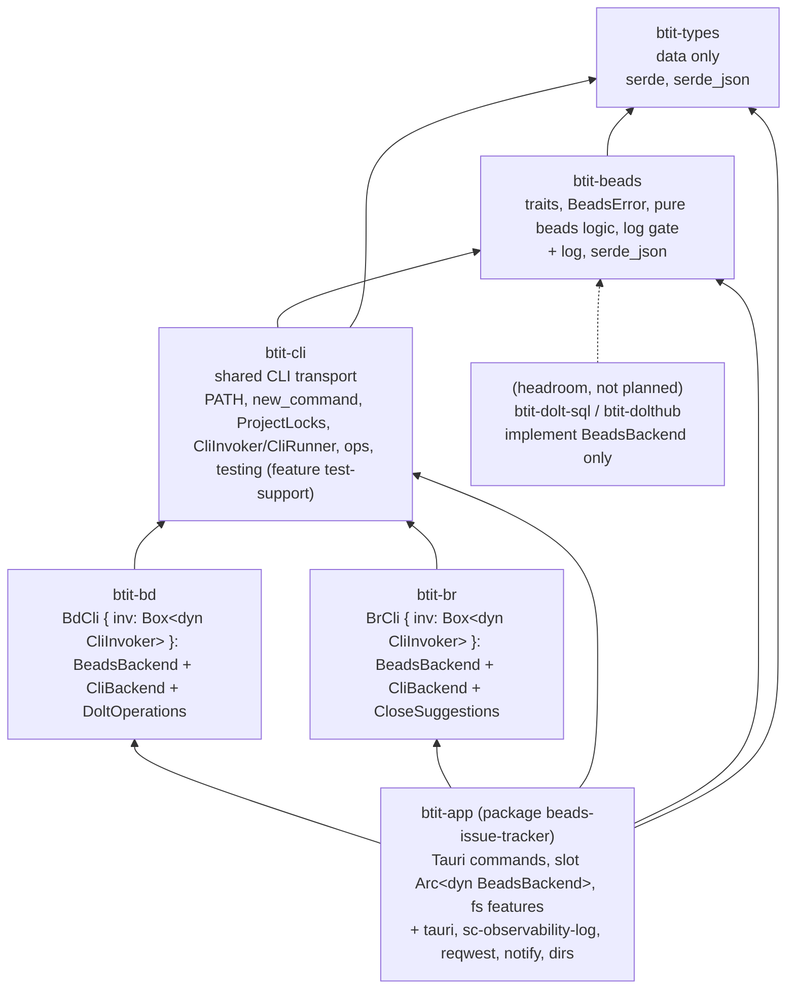
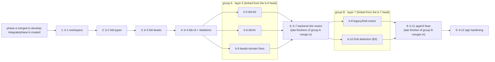

# phase-b: crate split

## Why this phase exists

btit's Rust backend is one Tauri crate, `src-tauri/` (package `beads-issue-tracker`, lib `app_lib`, 17 source files, 7 047 lines, 65 Tauri commands in `generate_handler!` at `src-tauri/src/lib.rs:71-137`). The module split of stack #31 (PRs #29, #30, #32) left the beads-CLI logic, the frontend data contract and the Tauri glue in the same crate, and its review recorded behaviour issues to carry into "the next refactor" (`docs/crate-split-refactor-issues.md`). ADR-003 (`git show origin/docs/adr-initial:docs/architecture.md`) states the decision: "Moving btit's backend into root `crates/` and splitting it into multiple crates is phase-b."

phase-b does that split. It is a **behaviour-preserving restructuring** followed by three bounded behaviour-fix sprints and one hardening sprint:

1. one Cargo workspace at the repository root with every Rust crate under `crates/`, the same layout as `../atm-core`, `../sc-compose` and `../sc-observability` (each has a root `Cargo.toml` `[workspace]` with `members = ["crates/…"]`, verified 2026-09-13);
2. `btit-types`: shared data types only;
3. `btit-beads`: the backend traits shared by bd and br, the backend-specific traits, the discriminated-union error, and the pure beads logic (version parsing, capability gates, issue transformation);
4. `btit-cli`: the process-spawning transport both CLIs share (extended PATH, `--json`, per-project lock);
5. `btit-bd` and `btit-br`: the two backend implementations;
6. `btit-app`: the Tauri crate, reduced to command glue, filesystem features (attachments, migration, polling, watcher, updates, probe, logging) and backend selection.

Maintainer direction (2026-09-13) is authoritative for the constraints below and is restated in "Binding outcomes".

## Prerequisites (outside this phase)

- **phase-a merged to `develop`.** `integrate/phase-a` is merged to `develop` through the single phase PR after a-6 closes (`docs/plans/phase-a/plan-phase-a.md`, "Phase closure"). At planning time this has not happened: PR #50 (a-5) is open and a-6 has not started (no `docs/plans/phase-a/handoff-a-6.md`). phase-b sprint branches are created only after this merge.
- **`integrate/phase-b` exists, created from `develop` after that merge.** This plan does not create it. Every sprint's `target:` is `integrate/phase-b`.
- **`sc-observability-log` is available outside btit.** a-6 records the merged `../sc-observability` PR in `docs/plans/phase-a/handoff-a-6.md`. b-1 switches btit from the path dependency `sc-observability-log = { path = "../crates/sc-observability-log" }` (`src-tauri/Cargo.toml:38`) to the published crates.io version named in that record, or, when no crates.io release exists yet, to a `git` dependency on `https://github.com/randlee/sc-observability` pinned with `rev = <merge commit recorded in handoff-a-6.md>`. This is the "first phase-b sprint" step that `plan-phase-a.md` ("Not part of phase-a") assigns to phase-b.
- **Toolchain.** Rust 1.98.1 pinned by `rust-toolchain.toml` and enforced by `scripts/check_version_sync.py` (PR #36; ADR-004). Unchanged by this phase.
- **ADR holding document.** ADRs live in `docs/architecture.md`, which exists only on PR #42 (`docs/adr-initial` → `develop`, open at planning time; ADR-001..007 there are cited by this plan as *proposed*, not merged). b-1 requires that file on `develop`: if PR #42 is merged, b-1 appends ADR-009 to it; if not, b-1 creates `docs/architecture.md` with the same header and status legend as `origin/docs/adr-initial:docs/architecture.md` and appends ADR-009 (PR #42 then rebases). b-3 appends ADR-008.
- **Re-baselining at b-1 start.** This plan cites `src-tauri/src/*` line numbers at `a18c724`. phase-a's a-5 (PRs #50, #52, open) changes `logging.rs` (bridge lifecycle, `LogControl`, a `logging/lifecycle.rs` module per those PRs' descriptions), so `logging.rs` cites will be stale and other files may shift. b-1's first task records the implementation baseline (`develop@<sha>` after the phase-a merge) in its Implementation Notes and re-verifies every `file:line` cite this plan and the sprint docs make, correcting them in the sprint docs' Implementation Notes (not in this plan).

## Binding outcomes

### Workspace layout (maintainer requirement 1)

- **One workspace, root manifest.** `Cargo.toml` at the repository root holds `[workspace]`, `[workspace.package]`, `[workspace.dependencies]` and `[workspace.lints]`. Members are `crates/btit-app`, `crates/btit-types`, `crates/btit-beads`, `crates/btit-cli`, `crates/btit-bd`, `crates/btit-br`. One `Cargo.lock` at the root, one `target/` at the root.
- **Why not `crates/Cargo.toml`.** The transitional phase-a workspace at `crates/Cargo.toml` (`[workspace.package] version = "0.1.0"`, `edition = "2024"`, `rust-version = "1.94.1"`, `crates/Cargo.toml:9-13`) cannot be the btit workspace: `[workspace.package].version` must be the app version (`1.24.5`, `src-tauri/Cargo.toml:9`) and `check_version_sync.py:71-75` requires every member to inherit it. Cargo also resolves a package's workspace by walking up to the nearest `Cargo.toml` with `[workspace]`, so a second workspace nested under `crates/` would claim any new `crates/btit-*` crate. b-1 therefore dissolves the phase-a workspace: its three crates leave btit (prerequisite above) together with `crates/Cargo.toml`, `crates/Cargo.lock`, `crates/runtime-deps.txt` and the `crates` CI job (`.github/workflows/ci.yml:92-153`).
- **Version single source of truth (ADR-003).** `[workspace.package].version` in the root `Cargo.toml`. Every crate uses `version.workspace = true`. `tauri.conf.json` keeps no `version`. `scripts/check_version_sync.py` is updated in b-1 to read the root manifest, root lockfile and `crates/btit-app/tauri.conf.json`; its checks otherwise stay as they are (`check_version_sync.py:62-118`).
- **Toolchain (ADR-004).** `[workspace.package].rust-version = "1.98.1"` equals the `rust-toolchain.toml` channel; the script enforces it (`check_version_sync.py:99-107`). The phase-a MSRV job (`ci.yml:149-153`, `cargo +1.94.1`) leaves with the phase-a crates.
- **Edition.** Open question OQ-1. Sprint docs are written for `edition = "2021"` at the workspace level (today's app edition, `src-tauri/Cargo.toml:13`), so every move is code motion that the existing 142 tests pin. Switching to 2024 is a maintainer decision; if taken before b-1 starts, b-1 sets it and each crate-creating sprint runs `cargo fix --edition` as part of its move.

### Tauri app crate location (maintainer requirement 1)

The Tauri crate moves to `crates/btit-app/` (`Cargo.toml`, `build.rs`, `tauri.conf.json`, `capabilities/`, `icons/`, `src/`, `.gitignore`). Verified constraints:

- **tauri-cli 2.11.2 finds the app without `src-tauri/`.** `crates/tauri-cli/src/helpers/app_paths.rs` (`resolve_tauri_dir`, tag `tauri-cli-v2.11.2`): it honours `TAURI_APP_PATH`, then checks `<cwd>/tauri.conf.json` and `<cwd>/src-tauri/tauri.conf.json`, then walks the tree to depth 3 (`TAURI_CLI_CONFIG_DEPTH`, default 3) skipping `node_modules/` and `target/` (`crates/tauri-cli/tauri.gitignore`). From the repo root `crates/btit-app/tauri.conf.json` is at depth 3, so `pnpm tauri:dev` (`package.json:33`, `cargo tauri dev`) and `pnpm tauri:build` keep working unchanged. The frontend directory resolves to the directory holding `package.json` at the cwd (`resolve_frontend_dir`), so `beforeDevCommand`/`beforeBuildCommand` still run at the root. Running `cargo tauri dev` from inside `crates/btit-app` is not supported (the frontend fallback would be `crates/`); `pnpm tauri:dev` from the root is the documented entry point (CLAUDE.md "Dev Server").
- **`tauri.conf.json` paths are relative to the config directory.** `build.frontendDist` changes from `../.output/public` to `../../.output/public` (`src-tauri/tauri.conf.json:6`). `devUrl`, `beforeDevCommand`, `beforeBuildCommand`, `bundle.icon` (relative `icons/…`), `capabilities/default.json` (`$schema: ../gen/schemas/desktop-schema.json`) and `build.rs` (`tauri_build::build()`) are unchanged.
- **Release workflow.** `tauri-apps/tauri-action@v0` (`.github/workflows/release.yml:82`) locates the app by globbing `**/tauri.conf.json` under `projectPath` (default `.`), ignoring `target` and `node_modules` (`tauri-action/src/utils.ts`, `getTauriDir`), and resolves the target dir to `<workspace root>/target` (`getTargetDir`). The artifact globs `src-tauri/target/...` (`release.yml:89,109,133,143,171-175,210-214`) become `target/...`.
- **Package and binary name.** The package stays `beads-issue-tracker` with `[lib] name = "app_lib"` (`src-tauri/Cargo.toml:18,28`), so the executable name inside every bundle, the `Cargo.lock` entry and `env!("CARGO_PKG_VERSION")` (`updates.rs:62`) do not change. Renaming the package is OQ-2 (tauri-utils 2.8.2 exposes `mainBinaryName`, `config.rs:3289`, which would keep the binary name).
- **CI.** The `backend` job runs `cargo check --workspace --all-targets` and `cargo test --workspace` from the root (`ci.yml:87,90` today point at `src-tauri/Cargo.toml`); `Swatinem/rust-cache` `workspaces: src-tauri` (`ci.yml:84`) is removed (default `.`). A `rust-quality` job (fmt, clippy `-D warnings`) covers the new crates from b-2 and the app crate from b-12.

### `btit-types`: data only (maintainer requirement 2)

`btit-types` contains only shared data types: `struct`/`enum` definitions with `serde` derives, trivial constructors/`From` impls and `Display` for value types. No functions with I/O, no `std::process`, no `std::fs`, no Tauri, no `log`. Dependencies: `serde` (`derive`) and `serde_json` (needed by `BdRawIssue.metadata: Option<serde_json::Value>`, `BdRawComment.id: serde_json::Value`, `Issue.metadata`, `types.rs:71,78,121`). Enforced by b-2's acceptance gate (`cargo tree -e normal -p btit-types` equals `btit-types`, `serde`, `serde_json` plus their transitive closure, and `! grep -rE 'std::(process|fs|env)|tauri|log::' crates/btit-types/src`). The type-move inventory is below.

### Traits live in `btit-beads`, not in `btit-types` (maintainer requirement 3)

Traits are behaviour contracts: they name operations (`list`, `sync`, `project_uses_dolt`), carry `Result<_, BeadsError>` and are implemented by I/O crates. Placing them in `btit-types` would put behaviour and an error type into the "only data types" crate and would force every consumer of a DTO to compile the contract. They therefore live in `btit-beads`, one level above `btit-types`, together with the error enum and the pure beads logic that every backend shares (version parsing, capability `_for` cores, issue transformation). `btit-types` stays a leaf that the frontend contract, the traits and future transports can all depend on.

### Trait design (maintainer requirements 3, 4, 5)

Three trait families, all in `crates/btit-beads/src/backend.rs`, all object-safe (`dyn`-usable) and `Send + Sync`:

- **`BeadsBackend`** (transport-neutral; implemented by `btit-bd` and `btit-br`): the issue operations both CLIs support today, `project_uses_dolt(&self, project: &ProjectRef)`, `relation_types()`, `sync()`. It has no notion of a binary, a process, a version or `--json`; a future SQL transport against a beads Dolt server, or a DoltHub client, implements this trait alone. Everything transport- or backend-specific is reached through optional accessors with the same shape: `fn cli(&self) -> Option<&dyn CliBackend> { None }`, `fn dolt(&self) -> Option<&dyn DoltOperations> { None }`, `fn close_suggestions(&self) -> Option<&dyn CloseSuggestions> { None }`. The app therefore holds `Arc<dyn BeadsBackend>` and never downcasts; callers that need CLI facts (`config.rs`, `updates.rs`, the raw paths of `migration.rs`, `check_bd_compatibility`) call `backend.cli()` and map `None` to `BeadsError::Unsupported`.
- **`CliBackend: BeadsBackend`** (implemented by `btit-bd` and `btit-br`): what only a spawned CLI has: `binary()`, `probe()`, `client()`, `version()`, `capabilities()` (the detected client kind, version and the five version gates, which a SQL transport has no equivalent for), `run_raw()` (the un-JSON'd, un-locked invocations that `migration.rs` makes today), and `release_source()` (the GitHub repo pair of `check_bd_cli_update`, `updates.rs:285-292`; contract headroom in phase-b — the app keeps choosing the `BD_`/`BR_RELEASE_SOURCE` constants from `detect_cli_client(&version_str)` as today, so `release_source()` has no app caller until a transport-neutral update check exists).
- **Backend-specific traits:** `DoltOperations` (bd only today: `doctor --fix --yes`, `migrate --to-dolt --yes`, `init --prefix`, `import -i`; `migration.rs:333-339,623-629,665-671,879-885`) and `CloseSuggestions` (br only: `close <id> --suggest-next`, `issue_commands.rs:410-413`). `DoltOperations` is transport-neutral: its methods return `btit_types::DoltOpResult { success, message, detail }`, not process output, because today's callers read only the exit status, the trimmed stdout and the trimmed stderr (`migration.rs:341-352,631-643,672-682,779-781,890-903`); a SQL transport can implement `dolt()` with the same result type. Raw process output (`CliOutput`) exists only on `CliBackend::run_raw`, which keeps the byte-identical restore invocations (OQ-7).

Design headroom, not planned work: `ProjectRef` is a `#[non_exhaustive]` enum with the single variant `Local { cwd: Option<String> }` (today's `cwd: Option<&str>`); a remote transport adds a variant and callers that only pass a `ProjectRef` through do not change. The traits are synchronous, matching today's blocking `Command::output()` calls inside `async` Tauri commands (`cli.rs:555-560`); an async twin is not planned.

**No process-global client state in library crates (binding).** Today the CLI choice and its detected version are process globals: `AppConfig.cli_binary` and `static CLI_BINARY` (`config.rs:8-13`), `static CLI_CLIENT_INFO` (`cli.rs:19-20`), `static BD_PROJECT_LOCKS` (`cli.rs:14-15`). After phase-b every backend is an instance: `CliRunner` owns its binary and probe cache, `ProjectLocks` is passed in at construction, and `btit-beads`, `btit-cli`, `btit-bd`, `btit-br` contain no `static` mutable state other than the two logging atomics (gate in b-3..b-6: `! grep -rnE '^\s*(pub(\(crate\))? )?static ' crates/btit-{cli,bd,br}/src` and, for `btit-beads`, only `LOGGING_ENABLED`/`VERBOSE_LOGGING`). Two `BdCli`/`BrCli` instances for two projects can therefore coexist in one process. The only global that remains is the app's backend slot in `crates/btit-app/src/backend.rs` (b-7), reached through the single function `backend::current()`; a per-project resolver would replace that function's body (`backend::for_project(&ProjectRef)`) without touching any trait, backend crate or command signature. Whether to add per-project backend selection (config schema, Settings UI, and which project a command belongs to) is OQ-8; it is a product change, not a restructuring, so it is not planned here. Note: `.claude/codebase-map.md:390` lists a per-project `backendMode` localStorage key; `grep -rn backendMode app/` finds no such code at `a18c724`, so that row is stale and b-12 removes it.

**Dolt history (issue #51), headroom only.** Issue #51 (bead diff between two Dolt commits: `dolt_log`, `AS OF '<ref>'` snapshots and `dolt_diff` over the `issues`, `dependencies`, `labels` and `comments` tables) is a bd-Dolt-only capability. Under this design it is a further backend-specific trait next to `DoltOperations` (working name `DoltHistory`: commit log, snapshot at a ref, table diff between two refs), reached through an optional accessor like `dolt()`, implemented by `btit-bd` only and `None` for `btit-br`. It is referenced in `crates/btit-beads/docs/backend-contract.md` as headroom; no method, type or sprint for it is planned in phase-b, because #51's own open questions (SQL access path in embedded vs server mode, snapshot strategy) are undecided.

Signatures are in the trait inventory below and, authoritatively, in `sprint-b-3.md` "Explicit Code Samples". The design is recorded as **ADR-008** ("Beads backend contract": trait family, accessor pattern including `cli()`, the `CliBackend` split, transport-neutral `DoltOperations`, instance-only library crates, app-owned slot; alternatives considered: traits in `btit-types`, one fat trait with `Unsupported` errors, downcasting; consequences: SQL/DoltHub transports, OQ-8), owned by b-3 and appended to `docs/architecture.md`.

**Backend construction (invoker-generic).** `BdCli` and `BrCli` hold `inv: Box<dyn CliInvoker>` (the `btit-cli` invocation trait), not a concrete runner: `new(binary, locks)` wraps a `CliRunner`; `with_invoker(inv)` exists behind the crate feature `test-support = ["btit-cli/test-support"]` (declared in the b-4 skeleton manifests, not `#[cfg(test)]`, so the app's own tests can use it too) and takes `btit_cli::testing::RecordingInvoker`. `CliInvoker` gains `fn probe(&self) -> Option<CliProbe>` so `CliBackend::probe` also goes through the invoker.

**Command contract gates (maintainer requirement 6).** Two mechanical gates, referenced by b-4, b-7, b-8, b-12 and phase closure:

```bash
# (1) Tauri command signatures: the whole `fn …` header up to `{` (name, visibility, async, parameters with types, return type),
#     at $IMPLEMENTATION_BASELINE (the develop@<sha> b-1 records) vs HEAD, must diff empty. Whitespace and the `( `/`, )` of wrapped
#     headers are normalized so multi-line headers (watcher.rs:37-41) compare equal to single-line ones; subdirectories are included.
sig() { find "$1" -name '*.rs' | sort | while read -r f; do awk '/#\[tauri::command\]/{c=1; buf=""; next} c{buf=buf " " $0; if ($0 ~ /\{/){gsub(/[[:space:]]+/," ",buf); sub(/ *\{.*$/,"",buf); gsub(/\( /,"(",buf); gsub(/, \)/,")",buf); gsub(/,\)/,")",buf); sub(/^ /,"",buf); print buf; c=0}}' "$f"; done | sort; }
: "${IMPLEMENTATION_BASELINE:?}"; BASE=/tmp/btit-baseline-$IMPLEMENTATION_BASELINE; [ -d "$BASE" ] || git worktree add "$BASE" "$IMPLEMENTATION_BASELINE"   # same baseline worktree as the test-preservation gate
diff <(sig "$BASE/src-tauri/src") <(sig crates/btit-app/src)
# (2) Every name the frontend invokes exists in generate_handler!.
comm -23 <(grep -oE "invoke[<(][^)]*'[a-z_]+'" app/utils/bd-api.ts | sed -E "s/.*'([a-z_]+)'/\1/" | sort -u) <(sed -n '/generate_handler!\[/,/\]/p' crates/btit-app/src/lib.rs | grep -oE '[a-z_]+::[a-z_]+' | sed 's/.*:://' | sort -u)   # must print nothing
```

Every "prints nothing" gate in this plan and the sprint docs is executed as `test -z "$(…)"`; every "is empty" diff gate as the command's exit status.

Gate (1) compares header text, so parameter and return types keep their `a18c724` spelling: a type that moves to `btit-types` (`CompatibilityInfo`, `ListOptions`, `CliOutput`, …) is imported with `use` in the file that declares the command and named bare in the header, never path-qualified (`btit_types::CompatibilityInfo`) there. Attributes and doc comments added to a command (`#[allow(..)]`, `///`) go above `#[tauri::command]`, never between it and `fn`, because the awk collects every line from the attribute to the first `{`.

### Behaviour preserved (maintainer requirement 6)

- **bd first, br secondary, fallback bd:** `CLI_CANDIDATES = ["bd","br"]`, `CLI_FALLBACK = "bd"`, `MIN_SUPPORTED_BD_MAJOR = 1`, `rank_cli_candidate`, `select_default_binary` (`cli.rs:76-84,130-163`) move unchanged (pure parts to `btit-beads`, the spawning `probe_cli_binary`/`default_cli_binary` to `btit-cli`).
- **bd < 1.0 warning:** `is_legacy_bd`, `cli_compatibility_warnings` (`cli.rs:115-121,218-253`) move unchanged to `btit-beads`; `check_bd_compatibility` keeps its name and its `CompatibilityInfo` JSON shape (`app/utils/bd-api.ts:711-733`).
- **Version-gated helpers:** the five pure `_for` cores keep their names and `(CliClient, u32, u32, u32)` signatures (`cli.rs:372,392,413,434,453`) so their table-driven tests (`cli.rs:1307-1421`) move byte-identical; the wrappers become `CliBackend::capabilities()` (reached from the app through `backend.cli()`), computed from the backend's cached probe.
- **`project_uses_dolt` checks:** `BeadsBackend::project_uses_dolt(&self, project: &ProjectRef)` (every caller derives today's `beads_dir` as `<working_dir>/.beads`, so the app passes the project and the bd backend derives the directory); `btit-bd` keeps `project_uses_dolt_for` (`cli.rs:482-515`), `btit-br` returns `false` (the `Br` arm, `cli.rs:487`). Every call site (`watcher.rs:86`, `fs_commands.rs:50,73`, `polling.rs:96`, `migration.rs:200,270,330,513,588`) keeps calling it before choosing a legacy path.
- **`get_extended_path` probing:** `get_extended_path`, `extended_path_entries`, `new_command` (`cli.rs:22-72,200-207`) move to `btit-cli`; every spawn keeps `.env("PATH", get_extended_path())` and `--version` probes keep `current_dir(std::env::temp_dir())`.
- **Tauri command names and signatures:** the 65 names in `generate_handler!` (`lib.rs:71-137`), their argument names and their `Result<_, String>` shapes are unchanged; the 57 names the frontend invokes (`app/utils/bd-api.ts`) and the `beads-changed` event (`app/composables/useChangeDetection.ts:59`) are unchanged. Error strings the frontend matches (`SCHEMA_MIGRATION_ERROR`, `no such column: spec_id`, `bd-api.ts:253,256`; `Dolt backend configured but database not found`, `bd-api.ts:291`) are reproduced verbatim by `BeadsError`'s `Display`.
- **Gated logging:** `LOGGING_ENABLED`/`VERBOSE_LOGGING` and the `log_info!`/`log_warn!`/`log_error!`/`log_debug!` macros (`logging.rs:32-66`) move to `btit-beads::logging` as `#[macro_export]` macros, so every moved call site keeps its enabled/verbose gate. Two logging changes are allowed, both log text only and of the same class as refactor item A1: (1) the `context` label passed to `parse_issues_tolerant` (for example `bd_list_open`) may become the trait method name; (2) the `log` target of moved code changes with its module path (today `app_lib::cli`, `app_lib::issues`; after the move `btit_cli::run`, `btit_beads::parse`, …, taken from `module_path!()` via `log::Record::target()`), which the JSONL `target` field and the debug panel render without any dependency on the old names (a-4 acceptance criterion 9, `sprint-a-4.md`).

**Backend selection state.** Today the client kind is detected lazily and cached in `CLI_CLIENT_INFO` (`cli.rs:326-365`) and re-detected when the cache is empty. After b-7 the app builds one backend instance per configured binary (`btit_app::backend::build_backend`) and holds it as `Arc<dyn BeadsBackend>`: the probe result selects `BrCli` when the probe reports client `Br` with a parsed version; `BdCli` otherwise (`Bd`, `Unknown`, `Br` without a parsed version, or no answer — today's `_ =>` arms, `cli.rs:361-364`). The instance is rebuilt by `set_cli_binary_path` (today: `reset_bd_version_cache`, `config.rs:101`) and by `check_bd_compatibility` when its fresh probe reports a different client kind (today it refreshes the cache, `cli.rs:643-646`). A failed or unparsable probe is remembered as `ProbeState::Failed` (from b-11; until then re-probed as today) and reports `client() == Unknown`, `version() == None`, all capabilities `false`. The one accepted deviation: a binary whose `--version` fails at startup and later starts answering as `br` is still driven as `BdCli` until one of those two commands runs; today it would flip on the next gated call. This is recorded in sprint b-7.

### Engineering standards (maintainer requirement 7; ADR-001)

- **Errors are discriminated unions.** `btit_beads::BeadsError` is an `enum` with typed variants, `code()` and `remediation()` per variant, and a `Display` that reproduces today's command error strings (table in `sprint-b-3.md`). No `Box<dyn Error>`, no `String` errors cross a crate boundary. The Tauri commands keep `Result<_, String>` at the IPC edge by `map_err(|e| e.to_string())`.
- **No panics; deny lint set.** The root `[workspace.lints]` is phase-a's set (`crates/Cargo.toml:31-43`): `pedantic` warn plus `unwrap_used`, `expect_used`, `panic`, `unreachable`, `todo`, `unimplemented`, `indexing_slicing` = `deny`. `btit-types`, `btit-beads`, `btit-cli`, `btit-bd`, `btit-br` inherit it from creation (`[lints] workspace = true`, per-crate `clippy.toml` `allow-*-in-tests`). Moved code is fixed where it violates: `parts[0]`/`parts[1]`/`parts[2]` in `parse_bd_version` (`cli.rs:314-317`), `.lock().unwrap()` on `CLI_CLIENT_INFO` and `BD_PROJECT_LOCKS` (`cli.rs:327,519,548,553`). `btit-app` adopts the lint set in b-12 (`logging.rs` already carries the file-level `#![deny(..)]` from a-4).
- **Crates do not wrap `sc-observability-log`.** Only `btit-app` depends on `sc-observability-log` (`install_logging`, `logging.rs:88-110`). Library crates depend on the `log` facade only; `btit-beads::logging` gates calls, it does not wrap the bridge.
- **Formatting and clippy in CI.** `cargo fmt --check` and `cargo clippy --all-targets -- -D warnings` per new crate from the sprint that creates it; the app crate (283 rustfmt diffs and 19 clippy warnings at the baseline) joins in b-12.

### sc-lint (pending maintainer input)

_Left empty on purpose: the maintainer started this section and has not supplied its scope. Nothing here is planned._

## Crate dependency graph



Dependency rules (checked by each sprint's `cargo tree` gate): `btit-types` has no workspace dependency; `btit-beads` depends only on `btit-types`; `btit-cli` on `btit-types`, `btit-beads`; `btit-bd` and `btit-br` on those three and never on each other; only `btit-app` depends on `tauri` and `sc-observability-log`.

## Trait inventory

Source columns cite `src-tauri/src/` at `a18c724`. "bd"/"br" mark the implementing crate. Full signatures are in `sprint-b-3.md`.

### `BeadsBackend` (transport-neutral; bd and br today, any future transport)

| Method | Today's source | Notes |
| --- | --- | --- |
| `project_uses_dolt(project: &ProjectRef) -> bool` | `project_uses_dolt` / `project_uses_dolt_for`, `cli.rs:473-515`; every caller derives `beads_dir` as `<working_dir>/.beads` (`watcher.rs:51`, `fs_commands.rs:48,71`, `polling.rs:76,175`, `migration.rs:199,269,322,490,580`) | bd: resolves the working dir, then the full check; br: `false`; an unresolvable `ProjectRef` → `false` |
| `cli() -> Option<&dyn CliBackend>` | new accessor | bd, br: `Some(self)`; a non-CLI transport: `None` |
| `list(project, &ListQuery) -> Result<Vec<BdRawIssue>>` | `bd_list` arg building and `--all` fallback, `issue_commands.rs:18-69`; `bd_count` two-call form `:81-90`; `bd_poll_data` `polling.rs:43-56` | `--limit=0` always; two-call fallback when `!supports_list_all_flag` |
| `ready(project) -> Result<Vec<BdRawIssue>>` | `bd_ready`, `issue_commands.rs:139-141` | |
| `status(project) -> Result<serde_json::Value>` | `bd_status`, `:149-152` | |
| `show(project, id) -> Result<Option<BdRawIssue>>` | `bd_show`, `:162-205` | not-found stderr and empty stdout → `None`; array-or-object; strict deserialize error |
| `create(project, &CreatePayload) -> Result<BdRawIssue>` | `bd_create`, `:214-274` | flag mapping incl. `priority_to_number` |
| `update(project, id, &UpdatePayload) -> Result<Option<BdRawIssue>>` | `bd_update`, `:285-394` | empty stdout → `show` fallback; lenient `.ok()` parse |
| `close(project, id) -> Result<serde_json::Value>` | `bd_close`, `:409-423` | br impl adds `--suggest-next` via `CloseSuggestions` |
| `search(project, query) -> Result<Vec<BdRawIssue>>` | `bd_search`, `:433-447` | empty / `[]` → empty vec; strict `Vec<BdRawIssue>` |
| `label_add` / `label_remove(project, id, label) -> Result<()>` | `:455-456`, `:463-464` | |
| `delete(project, id) -> Result<()>` | `bd_delete` args `:470-475` | `--force` plus `--hard` when `supports_delete_hard_flag` |
| `comment_add(project, id, content) -> Result<()>` | `bd_comments_add`, `:511-513` | |
| `dep_add(project, from, to, relation_type: Option<&str>) -> Result<()>` | `bd_dep_add` `:520-522`, `bd_dep_add_relation` `:538-540` | `--type <t>` when `Some` |
| `dep_remove(project, from, to) -> Result<()>` | `bd_dep_remove` `:529-531`, `bd_dep_remove_relation` `:547-549` | |
| `relation_types() -> Vec<RelationType>` | `bd_available_relation_types`, `:555-581` | br: common 7; bd/unknown: common + `tracks`, `until`, `validates` |
| `sync(project) -> Result<()>` | `sync_bd_database` spawn `migration.rs:222-232`; `bd_sync` `:278-288` | `sync [--no-daemon]`, no `--json`, no project lock (as today) |
| `dolt() -> Option<&dyn DoltOperations>` | new accessor | bd: `Some(self)`; br: `None` |
| `close_suggestions() -> Option<&dyn CloseSuggestions>` | new accessor | br: `Some(self)`; bd: `None` |

### `CliBackend: BeadsBackend` (bd and br)

| Method | Today's source | Notes |
| --- | --- | --- |
| `binary() -> String` | `get_cli_binary`, `config.rs:58-60` | the configured name/path (owned, as `get_cli_binary` returns today) |
| `probe() -> Option<CliProbe>` | `probe_cli_binary`, `cli.rs:185-196` | fresh `--version` run from the temp dir, through the invoker |
| `client() -> CliClient` | `get_cli_client_info` client part, `cli.rs:326-365` | from the cached probe; `Unknown` when the probe failed |
| `version() -> Option<CliVersion>` | `get_cli_client_info` tuple part | same |
| `capabilities() -> BackendCapabilities` | `supports_daemon_flag`, `uses_jsonl_files`, `supports_list_all_flag`, `supports_delete_hard_flag`, `uses_dolt_backend` wrappers, `cli.rs:380-385,400-405,421-426,441-446,461-466` | computed from the `_for` cores with the cached probe |
| `run_raw(project, args: &[&str]) -> Result<CliOutput>` | `new_command(..).args(..).current_dir(..).env("PATH",..).env("BEADS_PATH",..).output()` pattern, `migration.rs:227-232,282-288,333-339,403-408,623-629,665-671,771-777,879-885,944-950,1003-1009,1081-1087` | no `--json`, no lock; returns status, stdout, stderr |
| `release_source() -> ReleaseSource` | `check_bd_cli_update`, `updates.rs:285-292` | bd/unknown: `steveyegge/beads`; br: `Dicklesworthstone/beads_rust`. No app caller in phase-b (b-8 selects the constants from `detect_cli_client(&version_str)`, as today); contract headroom |

### `DoltOperations` (bd only today; transport-neutral result)

| Method | Today's source | What callers read (→ `DoltOpResult` field) |
| --- | --- | --- |
| `doctor_fix(project) -> Result<DoltOpResult>` | `bd_repair_database` Dolt path, `migration.rs:333-339` (`doctor --fix --yes`) | `status.success()` → `success`; `stdout.trim()` → `message` (`:342-346`); `stderr.trim()` → `detail` (`:350-352`) |
| `migrate_to_dolt(project) -> Result<DoltOpResult>` | `bd_migrate_to_dolt`, `:623-629` (`migrate --to-dolt --yes`) | `success`; `stdout.trim()` → `message` (`:632-636`); `stderr.trim()` → `detail`, reused in the init-fallback error (`:642-643,680-682`) |
| `init(project, prefix) -> Result<DoltOpResult>` | `:665-671`, `:771-777` (`init --prefix <p>`) | `success`; `stderr.trim()` → `detail` (`:679-682,779-781`) |
| `import_jsonl(project, file) -> Result<DoltOpResult>` | `:879-885` (`import -i <file>`) | `success`; `stderr.trim()` → `detail` (`:890-900`); `stdout.trim()` → `message` (`:903-904`) |

Spawn failures are `Err(BeadsError::Spawn { operation, .. })` so the app keeps `Failed to run bd doctor|migrate|init|import: {e}` (`:339,629,671,885`).

### `CloseSuggestions` (br only)

| Method | Today's source |
| --- | --- |
| `close_suggesting_next(project, id) -> Result<serde_json::Value>` | `bd_close` br branch, `issue_commands.rs:410-413` (`close <id> --suggest-next`) |

### Pure functions moving to `btit-beads` (not trait methods)

`detect_cli_client`, `parse_bd_version`, `parse_cli_probe` (`cli.rs:290-323,166-178`); `is_legacy_bd`, `rank_cli_candidate`, `select_default_binary`, `CLI_CANDIDATES`, `CLI_FALLBACK`, `MIN_SUPPORTED_BD_MAJOR` (`cli.rs:76-84,115-163`); `cli_client_name`, `cli_compatibility_warnings` (`cli.rs:209-253`); the five `_for` gate cores (`cli.rs:372-459`); `priority_to_string`, `priority_to_number`, `normalize_issue_type`, `normalize_issue_status`, `transform_issue`, `normalize_metadata`, `parse_issues_tolerant` (`issues.rs:3-312`).

## Type-move inventory

| Type | From (`src-tauri/src/`) | To | Change |
| --- | --- | --- | --- |
| `CliClient` | `types.rs:5-9` | `btit-types` | `pub(crate)` → `pub`; add `Eq`, `Hash` |
| `BdRawDependency`, `BdRawDependent`, `BdRawIssue`, `BdRawComment` | `types.rs:19-84` | `btit-types` | none |
| `Issue`, `Comment`, `ChildIssue`, `ParentIssue`, `Relation` | `types.rs:87-166` | `btit-types` | none |
| `CountResult`, `DirectoryEntry`, `PurgeResult`, `FsListResult` | `types.rs:169-208` | `btit-types` | none |
| `ListOptions`, `CwdOptions`, `CreatePayload`, `UpdatePayload` | `types.rs:215-281` | `btit-types` | none |
| `CliProbe` | `cli.rs:88-93` | `btit-types` | fields `pub`; `version: Option<CliVersion>` (was tuple) with `From<(u32,u32,u32)>` |
| `CliSelection` | `cli.rs:97-111` | `btit-beads::detect` | stays next to `select_default_binary` (it carries `is_legacy()` logic) |
| `CompatibilityInfo` | `cli.rs:597-619` | `btit-types` | fields `pub` |
| `CliVersion { major, minor, patch }` | new | `btit-types` | replaces `(u32, u32, u32)` at crate boundaries; `_for` cores keep the tuple |
| `BackendCapabilities` | new (today five `bool` wrappers) | `btit-types` | five `bool` fields |
| `ListQuery` | new (today the first six fields of `ListOptions`, `types.rs:215-223`) | `btit-types` | `Deserialize` with the same `#[serde(rename)]`s (`type`, `includeAll`); `ListOptions` becomes `{ #[serde(flatten)] query: ListQuery, cwd }`, JSON contract unchanged and pinned by a round-trip test |
| `DoltOpResult { success: bool, message: String, detail: String }` | new (today `std::process::Output` read as `status.success()`, `stdout.trim()`, `stderr.trim()`, `migration.rs:341-352,631-643,672-682,779-781,890-903`) | `btit-types` | transport-neutral result of `DoltOperations` |
| `ProjectRef` | new (today `cwd: Option<&str>`) | `btit-types` | `#[non_exhaustive] enum { Local { cwd: Option<String> } }` |
| `RelationType { value, label }` | new (today `(&str, &str)` tuples, `issue_commands.rs:556-569`) | `btit-types` | |
| `ReleaseSource { api_url, releases_url }` | new (today string literals, `updates.rs:285-292`) | `btit-types` | |
| `CliOutput { status: Option<i32>, success: bool, stdout, stderr }` | new (today `std::process::Output`: `status.code()`, `status.success()`, lossy stdout/stderr) | `btit-types` | |
| `BeadsError` | new (today `String`) | `btit-beads::error` | discriminated union |
| `PollData` | `polling.rs:22-29` | stays in `btit-app` | app-only DTO |
| `RepairResult`, `MigrateResult`, `CleanupResult`, `MigrationStatus` | `migration.rs:304-308,436-439,452-454,475-478` | stays in `btit-app` | app-only DTOs |
| `RefsMigrationStatus`, `MigrateRefsResult` | `attachment_refs.rs:27-38` | stays in `btit-app` | app-only |
| `ImageData`, `AttachmentFile`, `TextData` | `attachments.rs:68-71,432-437,570-572` | stays in `btit-app` | app-only |
| `UpdateInfo`, `GitHubAsset`, `GitHubRelease`, `BdCliUpdateInfo` | `updates.rs:14-56` | stays in `btit-app` | app-only |
| `WatcherState`, `BeadsChangedPayload`, `WatcherStatusInfo` | `watcher.rs:13-30,118-123` | stays in `btit-app` | Tauri state |
| `AppConfig` | `config.rs:11-14` | stays in `btit-app` | settings file |

## Issue inventory: `docs/crate-split-refactor-issues.md`

Every item maps to a sprint deliverable or an explicit out-of-scope note.

| Item | Disposition | Sprint |
| --- | --- | --- |
| A1 log target | Closed by phase-a a-4 (`plan-phase-a.md` issue inventory). No phase-b work. | — |
| A2 platform-gated imports (`updates.rs:4`, `attachments.rs:2`; `logging.rs` done in a-4) | Closed: fully-qualified call sites, verified with `cargo xwin check --target x86_64-pc-windows-msvc` | b-12 |
| A3 wrapper + pure-core extraction | No action (verified result-equivalent). The `_for` cores move unchanged. | — |
| A4 orphaned doc comment (`cli.rs:594-595`), moved comment, visibility | Closed: the orphaned comment is deleted with `CompatibilityInfo`'s move (b-2); `ensure_refs_migrated_v3` gets its doc comment when `migration.rs` is rewired (b-8); visibility is redefined by the crate boundaries (`pub` = crate API, everything else private) | b-2, b-8 |
| B1 unknown type/status rewritten | Closed: `normalize_issue_type`/`normalize_issue_status` pass unknown values through; tests replaced | b-9 |
| B2 `is_real_external_ref` substring match | Closed: URL scheme accepted first, Windows absolute paths local; tests added | b-11 |
| B3 Dolt detection false negatives on bd 1.x | Closed: bd ≥ 0.51 decides from `metadata.json` with bd's `GetBackend()` rule (missing/unknown → Dolt; `configfile.go:297-311`), no `dolt/<name>/.dolt` probe; `dolt_data_dir` honoured; tests replaced | b-10 |
| B4 `--hard` cutoff | Closed: cutoff moves to 0.51.0; test updated | b-9 |
| B5 `uses_dolt_backend`/`uses_jsonl_files` cutoff | Closed: cutoff moves to 0.51.0; `warnings_for_0_50_through_0_56_include_dolt_note` condition updated with it | b-9 |
| B6 test that cannot fail | Closed: `get_beads_mtime_for(uses_dolt: bool, uses_jsonl: bool, dir)` pure core; test asserts `None` | b-11 |
| B7 `supports_list_all_flag` doc vs code for br | **Open question OQ-4.** br source is not on disk and `br` is not installed (verified 2026-09-13). b-9 fixes whichever side the maintainer confirms; until then the doc comment is changed to say "unverified" and the code is unchanged | b-9 |
| B8 attachment folders keyed by short ID | Closed as documentation: `docs/attachments.md` `{issue-id}` becomes `{short-id}` with the collision note; the test gains the collision comment. Changing the layout is out of scope (it would need a data migration) | b-11 |
| B9 pre-release version comparison | Closed: strip from `-` before splitting; test comment and assertions fixed | b-11 |
| B10 tests that assert nothing off macOS; wrapper-calling test | Closed: `find_platform_asset` tests use an injectable suffix (b-11); `project_uses_dolt_false_without_beads_dir` calls the `_for` core (b-10) | b-10, b-11 |
| B11 priority parsing | Closed: case-insensitive `p`/`P`; values outside 0–4 fall back to `"3"` (bd rejects them, `../beads/internal/validation/bead.go` `ParsePriority`); test extended | b-9 |
| B12 `sanitize_filename` extension | Closed: extension sanitized; exact-output assertion | b-11 |
| B13 misleading test name (`cli.rs:1295`) | Closed: renamed | b-10 (test moves with `project_uses_dolt_for` to `btit-bd` in b-5) |
| B13 out-of-range case in `warnings_for_0_50_through_0_56` (`cli.rs:1089`) | Closed: 0.99.0 case removed; message substrings kept | b-9 |
| B13 invalid `related-to` fixture (`issues.rs:653,661`) | Closed: fixture uses `relates-to` | b-9 |
| B13 blocking deps shown as relations (`conditional-blocks`, `waits-for`) | Closed: added to the structural set in `transform_issue`, so they feed `blocked_by`/`blocks`; test added | b-9 |
| B13 failed version parse not cached | Closed: `CliRunner` caches the failed probe; reset on `set_cli_binary_path` and `check_bd_compatibility` | b-11 |
| B13 double warning (legacy banner plus parse warning) | Out of scope: frontend banner behaviour, unverified in the UI; recorded as OQ-5 | — |

## Sprint sequence

Layer numbers are relative to the parallel groups defined in "Parallel groups: fork and re-merge" below; members of a group share a layer label and are not given fixed numbers.

| Sprint | Branch | Stack · layer | Depends on (`must_follow`) | Parallel with (`parallel_safe`) | Authoritative plan | Production closure |
| --- | --- | --- | --- | --- | --- | --- |
| `b-1` | `feature/sprint-b-1-workspace-foundation` | `phase-b-core` · 1 | phase-a merged; `integrate/phase-b` exists | none | [`sprint-b-1.md`](./sprint-b-1.md) | root workspace; Tauri crate at `crates/btit-app`; phase-a crates replaced by the published dependency; CI, release, version script, docs paths updated; app builds and 142 tests pass |
| `b-2` | `feature/sprint-b-2-btit-types` | `phase-b-core` · 2 | b-1 | none | [`sprint-b-2.md`](./sprint-b-2.md) | `btit-types` crate with the inventory above; app consumes it |
| `b-3` | `feature/sprint-b-3-btit-beads` | `phase-b-core` · 3 | b-2 | none | [`sprint-b-3.md`](./sprint-b-3.md) | `btit-beads`: traits, `BeadsError`, pure logic and tests moved, logging gate; app consumes the pure logic |
| `b-4` | `feature/sprint-b-4-btit-cli` | `phase-b-core` · 4 | b-3 | none | [`sprint-b-4.md`](./sprint-b-4.md) | `btit-cli`: PATH, `new_command`, `ProjectLocks`, `CliRunner`, probe/auto-detect, shared issue-op bodies, `testing::RecordingInvoker`; app adopts `ops` through a transitional `AppInvoker`; empty `btit-bd`/`btit-br` skeleton crates pre-registered (members, manifests, lockfile, CI rows) |
| `b-5` | `feature/sprint-b-5-btit-bd` | group A · layer 5 (b-5 \| b-6 \| b-9, first to close) | b-4 | b-6, b-9 | [`sprint-b-5.md`](./sprint-b-5.md) | `btit-bd`: `BdCli` implementing `BeadsBackend`, `CliBackend`, `DoltOperations`; `project_uses_dolt_for` and its tests |
| `b-6` | `feature/sprint-b-6-btit-br` | group A · layer 5 | b-4 | b-5, b-9 | [`sprint-b-6.md`](./sprint-b-6.md) | `btit-br`: `BrCli` implementing `BeadsBackend`, `CliBackend`, `CloseSuggestions` |
| `b-9` | `feature/sprint-b-9-beads-domain-fixes` | group A · layer 5 | b-3 (content), forked from the b-4 head | b-5, b-6 | [`sprint-b-9.md`](./sprint-b-9.md) | B1, B4, B5, B11, B13 (fixture, out-of-range case, blocking relations) fixed in `btit-beads` with tests replaced; B7 per OQ-4 |
| `b-7` | `feature/sprint-b-7-backend-slot` | `phase-b-core` · 6 | b-5, b-6, b-9 (all merged in) | none | [`sprint-b-7.md`](./sprint-b-7.md) | backend slot + factory + `check_bd_compatibility`; `config.rs`, `lib.rs`, `issue_commands.rs`, `bd_poll_data`, `purge_orphan_attachments`, `sync_bd_database`/`bd_sync` on `Arc<dyn BeadsBackend>`; `AppInvoker`, `execute_bd` and the statics deleted; `cli.rs` reduced to slot-delegating shims |
| `b-8` | `feature/sprint-b-8-legacy-dolt-rewire` | group B · layer 7 (b-8 \| b-10, first to close) | b-7 | b-10 | [`sprint-b-8.md`](./sprint-b-8.md) | `migration.rs` repair/check/migrate on `DoltOperations`/`run_raw`; `get_beads_mtime`, `watcher.rs`, `fs_commands.rs`, `updates.rs` on the slot; `cli.rs` deleted; A4 doc comment |
| `b-10` | `feature/sprint-b-10-dolt-detection` | group B · layer 7 | b-5 (content), forked from the b-7 head | b-8 | [`sprint-b-10.md`](./sprint-b-10.md) | B3 Dolt detection redesign in `btit-bd` with its verification table; B10 wrapper-calling test; B13 rename |
| `b-11` | `feature/sprint-b-11-app-cli-fixes` | `phase-b-core` · 8 | b-8, b-10 (all merged in) | none | [`sprint-b-11.md`](./sprint-b-11.md) | B2, B6, B8, B9, B10 (platform tests), B12 in `btit-app`; B13 probe cache in `btit-cli`; tests replaced; test-preservation gate re-run with the b-9/b-10/b-11 replacement lists |
| `b-12` | `feature/sprint-b-12-app-hardening` | `phase-b-core` · 9 | b-11 | none | [`sprint-b-12.md`](./sprint-b-12.md) | `btit-app` inherits the workspace lints, no panics, fmt/clippy `-D warnings` clean, A2 closed; CHANGELOG, CLAUDE.md, codebase map, refactor-issues dispositions |

No deliverable is repeated across sprint checklists. Each sprint's status is its own sprint doc's `status:` frontmatter; this plan carries no status rows.

### Execution lanes



- **Trunk:** one gh-stack, `phase-b-core`, on `integrate/phase-b`. Layers 1–4 are single sprints. Layer 5 is group A, layer 6 is b-7, layer 7 is group B, layer 8 is b-11, layer 9 is b-12.
- **Group A (layer 5): b-5 | b-6 | b-9.** All three are forked from the `feature/sprint-b-4-btit-cli` head once b-4's closure criteria are met and QA has no Blocking finding. b-5 and b-6 need b-4's `CliRunner`/`ops`/skeletons; b-9 needs only b-3 but is forked from the same head to keep one group (its content dependency stays b-3). The three are pairwise `parallel_safe` (ownership below). The first to close is stacked as layer 5; the other two merge into b-7's branch (layer 6).
- **Group B (layer 7): b-8 | b-10.** Forked from the `feature/sprint-b-7-backend-slot` head once b-7's closure criteria are met and QA has no Blocking finding. b-8 rewires the legacy and Dolt paths of the app; b-10 redesigns Dolt detection inside `btit-bd` (content dependency: b-5, already below b-7). The first to close is layer 7; the other merges into b-11's branch (layer 8).
- **b-11 (layer 8)** must_follow b-8 and b-10; **b-12 (layer 9)** must_follow b-11 and is the last layer.

### Parallel groups: fork and re-merge (maintainer direction, 2026-09-13)

GitHub stacks are strictly linear: a branch has one parent and at most one stacked child (`~/.claude/skills/gh-stack/SKILL.md` "Known limitations" 1; phase-a met this with a-4). Parallel sprints therefore use this rule, stated once here and referenced from every group member's sprint doc:

1. **Fork.** All N sprints of a group branch from the layer-k branch head, in their own worktrees, and are developed in parallel. None is stack-linked at creation. Each opens a draft PR with base = the layer-k branch so CI (`feature/**` PR bases, `ci.yml:11`) and QA run on it.
2. **First closer becomes layer k+1.** The first sprint to reach closure (its acceptance criteria met, QA with no Blocking finding) is linked into the stack: `gh stack link <stack#> <its branch>`.
3. **Next layer from k+1.** The layer-(k+2) sprint — the next sprint that `must_follow` the whole group — is created from the layer-(k+1) head. The stack stays linear.
4. **Late finishers merge into k+2.** Each remaining side branch, when it reaches closure, is merged into the layer-(k+2) branch with `git merge --no-ff`; its draft PR is closed with a comment naming the merge commit. The layer-(k+2) sprint `must_follow` all N members, merges each pushed member before every dev/fix round (merge-forward), and its closure requires all N merged in (PR-completion).

Consequences: group members carry no fixed layer number (the label is "layer k+1 (a | b | c, first to close)"); downstream layers are numbered relative to the group; `parallel_safe` inside a group still requires non-intersecting files, proven in the ownership table, because the late merges must be conflict-free.

Two further maintainer rules (2026-09-13) apply to every layer and group member and are referenced from each sprint doc's "Dependency Relations":

- **Per-branch QA.** Each parallel branch completes its own QA-1 (its acceptance criteria and Required Validation, reviewed on its draft PR) before it is stacked as layer k+1 or merged into the layer-(k+2) branch. QA gating is per branch and never waits on a sibling.
- **Fix layers, no rewriting below.** Once a sprint's layer is integrated (stack-linked, or merged into its join layer), later QA findings or review fixes for it land as a **new fix layer on top of the current stack top**, branch `fix/sprint-b-N-<slug>`, linked with `gh stack link <stack#> fix/sprint-b-N-<slug>`. Lower layers are not amended or force-pushed, because CI is slow and a rebase cascade is expensive. A fix layer's doc is a short "Fix layer" section appended to the sprint doc it fixes (finding ids, files, validation), not a new sprint doc.

```bash
# Group A: fork all three from the b-4 head (after b-4 closure + QA no Blocking)
for b in b-5-btit-bd b-6-btit-br b-9-beads-domain-fixes; do
  git worktree add -b feature/sprint-$b ../beads-task-issue-tracker-worktrees/feature/sprint-$b feature/sprint-b-4-btit-cli
  git -C ../beads-task-issue-tracker-worktrees/feature/sprint-$b push -u origin feature/sprint-$b
  gh pr create --draft --base feature/sprint-b-4-btit-cli --head feature/sprint-$b ...
done
# First closer (example: b-5) becomes layer 5
gh stack link <stack#> feature/sprint-b-5-btit-bd
# Layer 6 (b-7) from the layer-5 head
git worktree add -b feature/sprint-b-7-backend-slot ../beads-task-issue-tracker-worktrees/feature/sprint-b-7-backend-slot feature/sprint-b-5-btit-bd
gh stack link <stack#> feature/sprint-b-7-backend-slot          # after its first push
# Late finishers (b-6, b-9) merge into the b-7 branch when they close; also run before every b-7 dev round for pushed members
git -C ../beads-task-issue-tracker-worktrees/feature/sprint-b-7-backend-slot fetch origin
git -C ../beads-task-issue-tracker-worktrees/feature/sprint-b-7-backend-slot merge --no-ff origin/feature/sprint-b-6-btit-br
git -C ../beads-task-issue-tracker-worktrees/feature/sprint-b-7-backend-slot merge --no-ff origin/feature/sprint-b-9-beads-domain-fixes
gh pr close <b-6 draft PR> --comment "merged into feature/sprint-b-7-backend-slot at <sha>"   # likewise b-9

# Group B: fork both from the b-7 head (after b-7 closure + QA no Blocking)
for b in b-8-legacy-dolt-rewire b-10-dolt-detection; do
  git worktree add -b feature/sprint-$b ../beads-task-issue-tracker-worktrees/feature/sprint-$b feature/sprint-b-7-backend-slot
  git -C ../beads-task-issue-tracker-worktrees/feature/sprint-$b push -u origin feature/sprint-$b
  gh pr create --draft --base feature/sprint-b-7-backend-slot --head feature/sprint-$b ...
done
gh stack link <stack#> <first closer of b-8 | b-10>             # layer 7
git worktree add -b feature/sprint-b-11-app-cli-fixes ../beads-task-issue-tracker-worktrees/feature/sprint-b-11-app-cli-fixes <layer-7 branch>
git -C ../beads-task-issue-tracker-worktrees/feature/sprint-b-11-app-cli-fixes merge --no-ff origin/<late finisher of group B>
```

## gh-stack and worktree workflow

The rules are those of `plan-phase-a.md` ("gh-stack and worktree workflow"; ADR-005), restated for phase-b:

- One GitHub stack, `phase-b-core`, managed with `gh stack link` and `gh stack merge`; no local stack tracking (`gh stack rebase`/`sync`/`view` fail from linked worktrees, verified in phase-a).
- Each layer and each group member is developed in its own `/sc-git-worktree` worktree under `../beads-task-issue-tracker-worktrees/<branch>`; the row in `../beads-task-issue-tracker-worktrees/worktree-tracking.md` is a local record, not a QA gate. The QA-visible record is each sprint doc's `worktree:` frontmatter.
- Stacked layers rebase with `git rebase <parent>` inside their worktree, bottom to top, then `git push --force-with-lease`. Group members rebase onto the layer-k branch they were forked from. A join layer (b-7, b-11) contains merge commits; it is rebased only with `git rebase --rebase-merges <parent>` so the join merges survive, or not at all (the fix-layer rule means a join layer is normally never rebased after integration).
- Stacked PRs merge with `gh stack merge <PR> --yes` bottom-up; never `gh pr merge` for a stack layer. b-1 merges as soon as it passes so the root workspace lands early. Group late finishers are never merged through GitHub; they enter the stack through the layer-(k+2) branch.
- Stack state is inspected only with `gh stack view --json` from the main checkout (`/gh-stack-view`).
- Evidence anchored across rebases uses annotated tags plus tree hashes, not layer SHAs.

```bash
# Layers 1-4 (repo root), each from its parent
git worktree add -b feature/sprint-b-1-workspace-foundation ../beads-task-issue-tracker-worktrees/feature/sprint-b-1-workspace-foundation origin/integrate/phase-b
git worktree add -b feature/sprint-b-2-btit-types            ../beads-task-issue-tracker-worktrees/feature/sprint-b-2-btit-types            feature/sprint-b-1-workspace-foundation  # when b-1 is pushed
git worktree add -b feature/sprint-b-3-btit-beads            ../beads-task-issue-tracker-worktrees/feature/sprint-b-3-btit-beads            feature/sprint-b-2-btit-types            # when b-2 is pushed
git worktree add -b feature/sprint-b-4-btit-cli              ../beads-task-issue-tracker-worktrees/feature/sprint-b-4-btit-cli              feature/sprint-b-3-btit-beads            # when b-3 is pushed
gh stack link --base integrate/phase-b feature/sprint-b-1-workspace-foundation feature/sprint-b-2-btit-types
gh stack link <stack-number> feature/sprint-b-3-btit-beads   # likewise b-4; layers 5-9 per "Parallel groups"
# b-12 (layer 9) from the b-11 head when b-11 is pushed
git worktree add -b feature/sprint-b-12-app-hardening        ../beads-task-issue-tracker-worktrees/feature/sprint-b-12-app-hardening        feature/sprint-b-11-app-cli-fixes

# Merge-forward before every dev/fix round on a stacked layer N (each in its own worktree)
git -C ../beads-task-issue-tracker-worktrees/<layer-N-branch> fetch origin
git -C ../beads-task-issue-tracker-worktrees/<layer-N-branch> rebase <layer-(N-1)-branch>   # layer 1 rebases onto origin/integrate/phase-b
git -C ../beads-task-issue-tracker-worktrees/<layer-N-branch> push --force-with-lease
```

## Dependency relations

Trigger definitions (referenced by every sprint doc): `must_follow` merge-forward trigger: parent development is pushed, not QA-approved; the parent is rebased (stack layer) or merged (group member) into the child before every dev/fix round. `must_follow` PR-completion trigger: the parent PR merges first, or, for a group late finisher, the member is merged into the layer-(k+2) branch. `parallel_safe`: no gate; requires non-intersecting modules, crates, public contracts, artifacts and ownership, proven in the ownership table. QA is per branch and post-integration fixes are new fix layers ("Parallel groups: fork and re-merge").

| Relation | Rationale |
| --- | --- |
| `b-1 must_follow phase-a merge` | b-1 removes the phase-a `crates/` workspace and depends on the published `sc-observability-log`; both need a-6 closed. |
| `b-2 must_follow b-1` | `btit-types` is a member of the root workspace b-1 creates. |
| `b-3 must_follow b-2` | traits, `BeadsError` and the pure logic are typed with `btit-types`. |
| `b-4 must_follow b-3` | `CliRunner` returns `BeadsError`, uses the pure parsers/gates and the `log_*!` macros from `btit-beads`. |
| `b-5 must_follow b-4` | `BdCli` wraps `CliRunner`, `ops` and `testing::RecordingInvoker`; fills the `btit-bd` skeleton b-4 registered. Group A. |
| `b-6 must_follow b-4` | `BrCli` wraps the same; fills the `btit-br` skeleton. Group A. |
| `b-9 must_follow b-3` (content); forked from the b-4 head | edits the pure functions b-3 moved into `btit-beads`, behind the frozen API. Group A. |
| `b-7 must_follow b-5, b-6, b-9` | the app builds `BdCli`/`BrCli` and deletes the code they replaced; as layer k+2 of group A it merges every member and closes only with all three merged in. |
| `b-8 must_follow b-7` | rewires the remaining app modules onto the slot b-7 introduces and deletes the shims b-7 leaves. Group B. |
| `b-10 must_follow b-5` (content); forked from the b-7 head | redesigns `project_uses_dolt_for` inside `btit-bd`. Group B. |
| `b-11 must_follow b-8, b-10` | edits app modules b-8 rewires (`attachment_refs.rs`, `polling.rs`, `updates.rs`, `attachments.rs`) and `btit-cli`; its test-preservation run applies the b-9, b-10 and b-11 replacement lists; as layer k+2 of group B it merges the late finisher. |
| `b-12 must_follow b-11` | lint rollout touches every app module after the last behaviour fix; collates every sprint's changelog lines. |
| `b-5 parallel_safe b-6` | `crates/btit-bd/**` + `sprint-b-5.md` vs `crates/btit-br/**` + `sprint-b-6.md`. The files both would otherwise touch (root `Cargo.toml` members, root `Cargo.lock`, `ci.yml` `rust-quality` rows, a cross-crate recording invoker) are written by b-4 (skeleton crates with final dependency sets; `btit_cli::testing` behind the `test-support` feature). Each has a `git diff --name-only` gate. |
| `b-5 parallel_safe b-9`, `b-6 parallel_safe b-9` | `crates/btit-beads/**` (behind the API frozen by `tests/api_freeze.rs`) vs `crates/btit-bd/**` / `crates/btit-br/**`; b-9 edits no manifest or workflow. b-6's capability and `--all` expectations are derived from `btit_beads::gates::capabilities_for(client, version)` rather than literals, so a b-9 flip of B7 (OQ-4) changes no b-6 file and needs no follow-up edit. |
| `b-8 parallel_safe b-10` | `crates/btit-app/**` (migration, polling mtime, watcher, fs_commands, updates, cli.rs deletion, lib.rs) vs `crates/btit-bd/**`; `crates/btit-bd/tests/api_freeze.rs` pins `project_uses_dolt_for`'s signature so b-8's callers are unaffected. b-8's app tests use only fixtures whose `project_uses_dolt` answer is the same under the `a18c724` rule and b-10's (`.beads/.dolt/` without `metadata.json` → Dolt; `.beads/beads.db` without `metadata.json`/`.dolt` → SQLite; probes `Bd 1.0.4`/`Bd 0.49.6` only; b-8 Deliverable 6), so b-10 edits no test owned by b-8 or b-11. |

### Ownership table

Every row is verified against each sprint doc's Exact Targets.

| Artifact | b-1 | b-2 | b-3 | b-4 | b-5 | b-6 | b-9 | b-7 | b-8 | b-10 | b-11 | b-12 |
| --- | --- | --- | --- | --- | --- | --- | --- | --- | --- | --- | --- | --- |
| root `Cargo.toml` | **creates** | adds member, deps | adds member | adds members `btit-cli`, `btit-bd`, `btit-br` | — | — | — | — | — | — | — | app `[lints]` |
| root `Cargo.lock` | **creates** | refresh | refresh | refresh (incl. skeletons' full dependency sets) | — | — | — | refresh (app deps `btit-bd`, `btit-br`) | — | — | refresh (only if `btit-cli` dev-deps change) | refresh |
| `crates/btit-app/src/cli.rs` | (moved file) | removes `CliProbe`, `CompatibilityInfo`, orphan comment | removes pure logic; re-exports | removes transport; adds `AppInvoker`, `execute_bd` wrapper, `PROJECT_LOCKS` | — | — | — | **reduces to slot-delegating shims**; deletes statics, `AppInvoker`, `execute_bd`, wrappers, app `project_uses_dolt_for` copy | **deletes the file** | — | — | — |
| `crates/btit-app/src/issue_commands.rs` | (moved) | `use` lines | `use` lines | **bodies → `ops` via `AppInvoker`** | — | — | — | **`backend::current()`** | — | — | — | lints, fmt |
| `crates/btit-app/src/polling.rs` | (moved) | `use` | `use` | `bd_poll_data` → `ops::list`/`ready` | — | — | — | `bd_poll_data` → slot | `get_beads_mtime` → slot | — | B6 `_for` core | lints, fmt |
| `crates/btit-app/src/attachments.rs` | (moved) | `use` | `use` | `purge_orphan_attachments` → `ops::list`; line 50 `crate::cli::new_command` → `btit_cli::command::new_command` | — | — | — | → slot | — | — | B8 comment, B12 | A2, lints, fmt |
| `crates/btit-app/src/migration.rs` | (moved) | `use` | `use` | `sync_bd_database`/`bd_sync` → `ops::sync` | — | — | — | sync → slot | **repair/check/migrate → `DoltOperations`/`with_cli(run_raw)`, `_with` cores; A4 doc comment** | — | — | lints, fmt |
| `crates/btit-app/src/{config,lib}.rs` | (moved) | — | `lib.rs` macro import | `lib.rs:41,53,64` → `btit_cli` paths; `config.rs:1` import, `config.rs:12` serde default → local `default_cli_binary()` | — | — | — | **slot install, factory wiring, `check_bd_compatibility` handler path** | `lib.rs` `mod cli` removal | — | — | lints, fmt |
| `crates/btit-app/src/backend.rs` | — | — | — | — | — | — | — | **creates** | — | — | — | lints |
| `crates/btit-app/src/{watcher,fs_commands,updates}.rs` | (moved) | `use` (`updates.rs`) | `use` (`updates.rs`) | `updates.rs:1,75` `new_command` → `btit_cli::command::new_command` | — | — | — | — | **→ slot; `updates.rs` selects `BD_`/`BR_RELEASE_SOURCE` by `detect_cli_client`** | — | B9, B10 (`updates.rs`) | A2 (`updates.rs`), lints, fmt |
| `docs/architecture.md` (ADR holding doc, PR #42) | **ADR-009** (fork-and-re-merge, per-branch QA, fix layers) | — | **ADR-008** (backend contract) | — | — | — | — | — | — | — | — | — |
| `crates/btit-app/src/attachment_refs.rs` | (moved) | — | — | — | — | — | — | — | — | — | **B2** | lints, fmt |
| `crates/btit-app/src/logging.rs` | (moved) | — | macros/atomics out, re-exports | — | — | — | — | — | — | — | — | `#![deny]` removal |
| `crates/btit-app/src/{types,issues,test_support}.rs` | (moved) | **deletes `types.rs`** | **deletes `issues.rs`, `test_support.rs`** | — | — | — | — | — | — | — | — | — |
| `crates/btit-app/{Cargo.toml,tauri.conf.json,…}` | **owns** | dep | dep | dep | — | — | — | deps `btit-bd`, `btit-br` | dev-deps with `test-support` | — | — | `[lints]` |
| `crates/btit-types/**` | — | **creates** | — | — | — | — | — | — | — | — | — | — |
| `crates/btit-beads/**` | — | — | **creates** (API frozen) | — | — | — | **fixes behind the frozen API** | — | — | — | — | — |
| `crates/btit-cli/**` (incl. `testing`, `test-support` feature) | — | — | — | **creates** | — | — | — | — | — | — | B13 probe cache | — |
| `crates/btit-bd/**` | — | — | — | skeleton (`Cargo.toml`, `clippy.toml`, doc-only `lib.rs`) | **implements** | — | — | — | — | **B3, B10, B13 rename** | — | — |
| `crates/btit-br/**` | — | — | — | skeleton | — | **implements** | — | — | — | — | — | — |
| `crates/sc-observability-log*/**`, `crates/Cargo.toml`, `crates/Cargo.lock`, `crates/runtime-deps.txt`, `src-tauri/**` | **deletes/moves** | — | — | — | — | — | — | — | — | — | — | — |
| `.github/workflows/ci.yml` | **backend job; removes `crates` job** | adds `rust-quality` | extends | extends for `btit-cli`, `btit-bd`, `btit-br` | — | — | — | — | — | — | — | workspace-wide fmt/clippy |
| `.github/workflows/release.yml` | **artifact paths** | — | — | — | — | — | — | — | — | — | — | — |
| `scripts/check_version_sync.py`, `rust-toolchain.toml` comments, `.gitignore`, `.sc/repowise/repowise.yaml`, `package.json` scripts | **owns** | — | — | — | — | — | — | — | — | — | — | — |
| `CLAUDE.md`, `.claude/codebase-map.md`, `docs/attachments.md` | **path fixes only** | — | — | — | — | — | — | — | — | — | B8 (`docs/attachments.md`) | **content** |
| `CHANGELOG.md`, `docs/crate-split-refactor-issues.md` disposition table | — | — | — | — | — | — | — | — | — | — | — | **owns** |
| `docs/plans/phase-b/sprint-b-N.md` `status:` frontmatter | own doc | own doc | own doc | own doc | own doc | own doc | own doc | own doc | own doc | own doc | own doc | own doc |

Non-intersection proofs for the `parallel_safe` pairs read straight off this table: group A members own `crates/btit-bd/**`, `crates/btit-br/**`, `crates/btit-beads/**` respectively and nothing else; group B members own disjoint sets (`crates/btit-app/**` vs `crates/btit-bd/**`; neither touches `Cargo.lock`). No sprint after b-6 edits `crates/btit-br/**`: its tests derive their expectations from `btit_beads::gates::capabilities_for`, so the B7/OQ-4 outcome propagates from `btit-beads` without a `btit-br` edit.

## Cross-sprint document ownership

- **b-1** rewrites every path reference to `src-tauri/` in `CLAUDE.md` (lines 44, 51, 67), `.claude/codebase-map.md` (lines 16, 208, 420), `docs/attachments.md` (line 78), `rust-toolchain.toml` (lines 1-4), `.sc/repowise/repowise.yaml` (lines 8, 12, 21) and `.github/workflows/*.yml`. `docs/crate-split-refactor-issues.md` lines 3 and 11 cite the historical commit `f6a0db3` and are left as they are.
- **b-1** appends ADR-009 to `docs/architecture.md` (fork-and-re-merge for parallel groups, per-branch QA-1, fix layers; context: gh-stack linearity verified in phase-a; consequences: join layers, `--rebase-merges`).
- **b-3** creates `crates/btit-beads/docs/backend-contract.md` (the trait contract with a "transport-neutral vs CLI-only" method list, error inventory, transport and #51 headroom notes, no-global-state rule) and appends ADR-008 to `docs/architecture.md`.
- **b-11** updates `docs/attachments.md` for B8.
- **b-12** owns `CHANGELOG.md` (`[Unreleased]` entry for the whole phase, collated from the sprint docs' "Changelog lines" sections), the `## Backend Structure` rewrite in `.claude/codebase-map.md`, the CLI-policy paragraphs in `CLAUDE.md`, and appends a disposition table to `docs/crate-split-refactor-issues.md`.
- **Every sprint** updates only the `status:` frontmatter (and, where a sprint doc says so, its Implementation Notes) of its own sprint doc; no sprint edits this plan.

## Error inventory

`btit_beads::BeadsError` is the only error type crossing crate boundaries. Its authoritative variant table, with `code()`, `remediation()` and the `Display` string each variant must reproduce, is in `sprint-b-3.md` "Required Work". Later sprints add no variants without a plan change; b-10's B3 work needs none (an unreadable or unparsable `metadata.json` yields `false`, not an error).

## Test preservation

The baseline has 142 tests (`cargo test --manifest-path src-tauri/Cargo.toml`, `a18c724`; per module: cli 59, issues 31, attachments 23, updates 9, attachment_refs 6, logging 6, migration 5, config 2, polling 1). Each moving sprint carries its tests to the destination crate unchanged (module path prefix aside). Every sprint up to b-8 runs the gate below and it must print nothing; b-9, b-10 and b-11 each list, by name, the pinned tests they replace and their replacements, and b-11 runs the gate with the union of those lists removed from the baseline (`comm -23 <(grep -vxFf /tmp/replaced.txt /tmp/baseline-tests.txt) /tmp/after-tests.txt`).

```bash
# Baseline tree: the develop@<sha> b-1 records; one worktree per baseline sha, shared with the signature gate.
: "${IMPLEMENTATION_BASELINE:?set from sprint-b-1.md Implementation Notes}"; : "${BASELINE_TEST_COUNT:?the test count b-1 recorded}"
BASE=/tmp/btit-baseline-$IMPLEMENTATION_BASELINE
[ -d "$BASE" ] || git worktree add "$BASE" "$IMPLEMENTATION_BASELINE"          # no 2>/dev/null: a failed checkout must fail the gate
cargo test --manifest-path "$BASE/src-tauri/Cargo.toml" -- --list | sed -nE 's/^(.*::)?([A-Za-z0-9_]+): test$/\2/p' | sort -u > /tmp/baseline-tests.txt
cargo test --workspace --all-features -- --list | sed -nE 's/^(.*::)?([A-Za-z0-9_]+): test$/\2/p' | sort -u > /tmp/after-tests.txt
# the optional `(.*::)?` group keeps integration-test names that have no module path (e.g. the JSON tests b-2 moves to crates/btit-types/tests/)
test -s /tmp/baseline-tests.txt && test "$(wc -l < /tmp/baseline-tests.txt)" -eq "$BASELINE_TEST_COUNT"   # non-vacuous: the baseline list is complete
test -s /tmp/after-tests.txt                                                                             # and the workspace listed its tests
comm -23 /tmp/baseline-tests.txt /tmp/after-tests.txt   # must print nothing (b-1..b-8); b-11 applies the replacement lists first
```

The baseline is `$IMPLEMENTATION_BASELINE`, never `integrate/phase-b` (which has no `src-tauri/` from b-2 on). `BASELINE_TEST_COUNT` is the count b-1 records (142 at `a18c724`); a mismatch or an empty list fails the gate instead of passing it vacuously.

## Phase closure

phase-b closes when all of the following hold:

- b-1 to b-12 are merged to `integrate/phase-b` (group members through their layer-(k+2) branch).
- `integrate/phase-b` is merged to `develop` through a single phase PR.
- `src-tauri/` no longer exists; `cargo tree --workspace -e normal` shows the dependency rules of the crate graph; `pnpm tauri:build` produces the bundles from `target/`; the release workflow's artifact globs match them.
- The Tauri command names in `generate_handler!` are unchanged from `$IMPLEMENTATION_BASELINE` (65 at `a18c724`, re-counted by b-1); the command-signature gate (1) diffs empty and the frontend invoke-subset gate (2) prints nothing ("Command contract gates").
- `docs/architecture.md` carries ADR-008 and ADR-009.

**Not part of phase-b:**

- Implementing a beads-dolt SQL transport or a DoltHub transport (design headroom only, maintainer requirement 5).
- Issue #51 (Dolt commit log and bead diff between commits): headroom as a future bd-only trait; not implemented.
- Per-project backend selection (OQ-8): the instance-based design permits it; the config/UI change is not planned.
- Splitting attachments, migration, polling, watcher, updates or probe out of `btit-app`.
- Changing the attachment folder layout (B8 is closed as documentation).
- The frontend double-warning question (B13, OQ-5).
- Structured-field logging call sites, `#[instrument]`, or any sc-observability-log API change.
- The "sc-lint" section, pending maintainer input.

## Open questions for the maintainer

| Id | Question | Default assumed by the sprint docs |
| --- | --- | --- |
| OQ-1 | Workspace `edition`: keep `2021` (today's app edition) for the phase-b moves, or adopt `2024` (the edition of `../atm-core`, `../sc-compose`, `../sc-observability` and the phase-a crates) now? | `2021`; a 2024 migration is a later change |
| OQ-2 | Package name of the Tauri crate: keep `beads-issue-tracker` (no artifact change), or rename to `btit-app` with `mainBinaryName = "beads-issue-tracker"` in `tauri.conf.json`? | keep `beads-issue-tracker`; directory `crates/btit-app` |
| OQ-3 | `sc-observability-log` dependency in b-1: crates.io version (preferred) or the git `rev` fallback? Depends on whether sc-observability has released when b-1 starts; the version/commit comes from `docs/plans/phase-a/handoff-a-6.md`. | crates.io if released, else git `rev` |
| OQ-4 | B7: does `br` support `list --all`? The doc comment (`cli.rs:409`) says no, the code (`cli.rs:416`) says yes; br source and binary are unavailable locally. | code unchanged; doc comment marked unverified |
| OQ-5 | B13 "double warning": should the frontend suppress the legacy banner when the version could not be parsed? Unverified in the UI. | out of scope for phase-b |
| OQ-6 | Gated logging: keep the `LOGGING_ENABLED`-gated `log_*!` macros (behaviour-preserving, moved to `btit-beads::logging`), or switch library crates to plain `log::` calls filtered by the bridge level? | keep the gate |
| OQ-7 | Should `bd_migrate_to_dolt`'s restore steps (`update <id> --set-labels <l>…` `migration.rs:937-942`, `dep add <id> <dep> --type <t>` `:1004`, `comments add <id> -f <file> --author <a>` `:1082`) keep their raw, un-JSON'd, un-locked invocations through `CliBackend::run_raw`, or go through `BeadsBackend` methods (`dep_add(.., Some(t))` is 1:1 with the dep step; the label step is `update --set-labels`, not `label add`, so `label_add` is not 1:1; `comment_add` takes inline text, not `-f`/`--author`; all three add `--json` and take the project lock)? | `run_raw`, byte-identical invocations |
| OQ-8 | Per-project backend selection: today one `cli_binary` applies to every project (`config.rs:8-13`, `cli.rs:19-20`). The phase-b traits and backends are instances with no process-global client state (binding rule above), so bd for one project and br for another is possible; should phase-b also add the per-project *selection* (a `cli_binary` per project in `settings.json`, Settings UI, and `backend::for_project(&ProjectRef)` replacing `backend::current()`), or is that a later feature? | later feature; b-7 keeps one slot behind the single `backend::current()` seam |
